```{r, echo=FALSE, results='hide', message=FALSE}
library("tidyverse");library("qqplotr");theme_set(theme_minimal());library("patchwork")
```



# Introduction to Statistics

## Intro to Statistics

::: {.incremental}
- **Statistics** - *the art of collecting, organizing, summarizing,
and describing data as well as drawing inferences from the data.*[- Dr. Amy Maddox]{.subtext}
  <!--- Statistics is math applied to real data [This often referred to as data science]{.subtext}-->
  - Statistics quantifies our uncertainty about our data [i.e Does our results from our sample generalize to the entire population?]{.subtext}

:::

:::{.callout-tip title="Example" .fragment style="font-size:1.25em;"}
Suppose the FDA requires more than 50% of possible patients to see improvement for a proposed drug to be approved. A pharmaceutical company in Austin, Tx has developed a new Alzheimer’s drug which is supposed to improve mental cognition. The company just finished its clinical trial and found 50.5% of those in the sample had improved mental cognition.
:::

:::{.fragment}
1. What are some reasons the drug should be approved?
2. What are some reasons the drug should NOT be approved?
:::


## Research Question
:::{.callout-important title="Goal of Statistics" style="font-size:1.25em;"}
Generally, the goal of statistics is to determine some characteristic about the population of interest. 
:::

:::{.fragment .center}
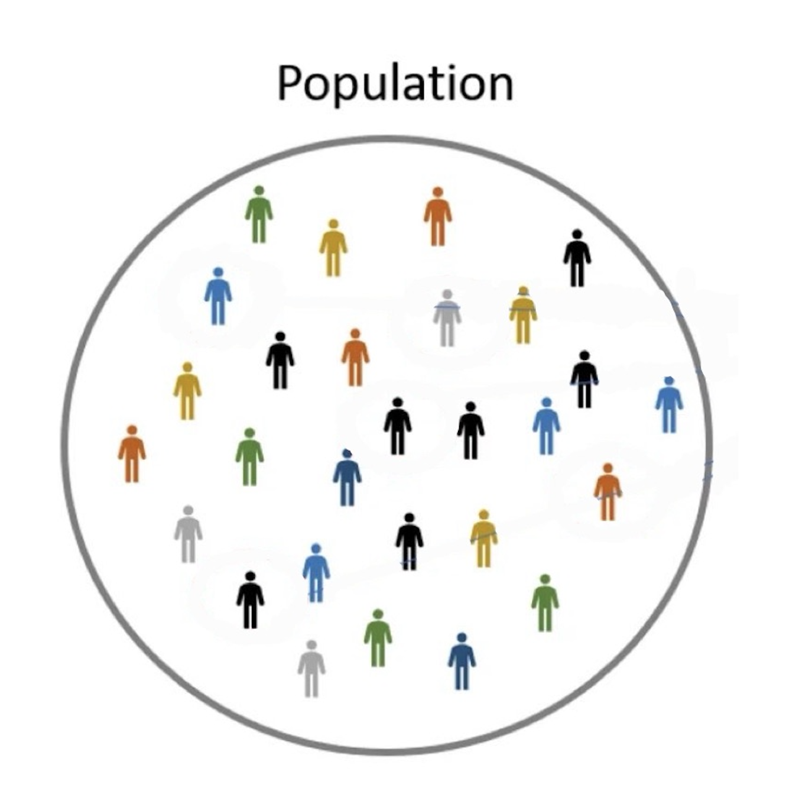{width=25%}
:::

:::{.fragment}
::: {style="position: absolute;top: 260px; left: 55%; width: 60px; transform: rotate(-45deg); height: 5px; background: red;"}
:::

:::{.absolute top=200px left=60%}
[?]{style="color:red;"}
:::
:::


:::{.incremental}
- This goal is often summarized in a **research question**
- A good research question should: 
  - References the population of interest
  - Not be too broad or too narrow
:::


## Research Question Cont.

:::{.callout-tip title="Example" style="font-size:1.25em;"}
UT wants to launch a new on-campus service and needs to determine if students are interested. 
UT proposes three research questions given below:

[1. How many current UT students are interested in using a new on-campus service?]{.fragment}

[2. Is the availability of evening hours related to student interest in using a new on-campus service?]{.fragment}

[3.  What impacts student interest in campus services?]{.fragment}

[Which research question is too broad, which is too narrow, and which is just right?]{.fragment}
:::

:::{.incremental}
1. [Too Narrow: can be answered with just one number]{.mysolution}
2. [Just right: analysis of a specific relationship(s)]{.mysolution}
3. [Too broad: there are an infinite amount of things that could "impact" student interest]{.mysolution}
:::

## Population of Interest and Census

:::{.incremental}
- We can only answer a research question with 100% accuracy if a census is taken
- **Census** - *a survey of the entire population of interest*
  - However, what is the issue with a census?
    - Census are very rare and in most cases unavailable
:::

:::{.fragment .callout-tip title="Example" style="font-size:1.25em;"}
UT wants to determine whether students would be interested in using a new on-campus service that is launching. What is the population of interest?
:::

::: {.fragment .center}
All [current]{.underline} students or all [possible]{.underline} students? 
:::

:::{.mysolution}
:::{.fragment .absolute top=64% right=385px style="width:100px; height:50px; border-radius:50%; border:2px solid red;"}
:::
:::


:::{.fragment}
[[Issue:]{.underline} It is impossible to get a census because it is impossible to survey all possible students (We do not know who all the possible students are).]{.mysolution}
:::


## When We Don't Have A Census

:::{.absolute top=75px}
- Since we can not take a survey of the entire population, generally we take a ______
:::

::: {.absolute top=200px left=350px}
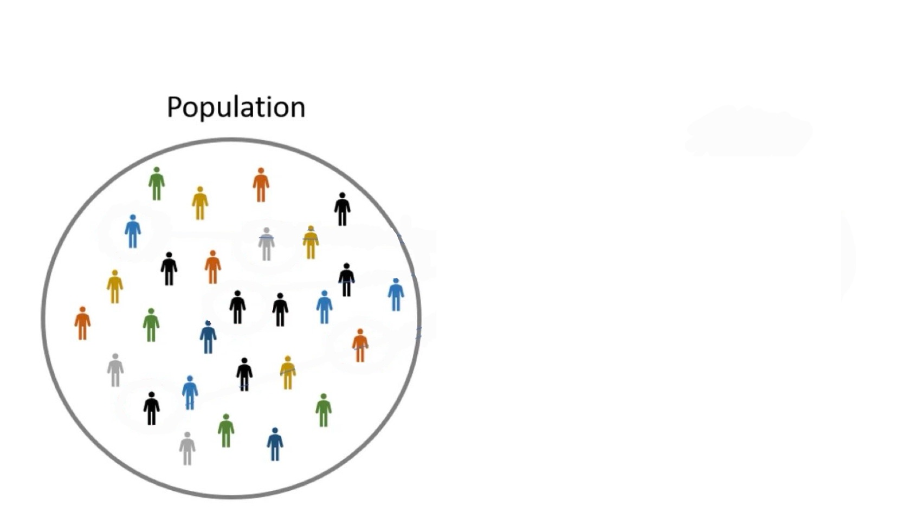{width=75%}
:::

:::{.fragment .absolute top=75px}
- Since we can not take a survey of the entire population, generally we take a [sample]{.mysolution}
:::

:::{.fragment}
:::{.absolute top=125px}
- **Sample** - *a subset of the population of interest*
:::

::: {.absolute top=200px left=350px}
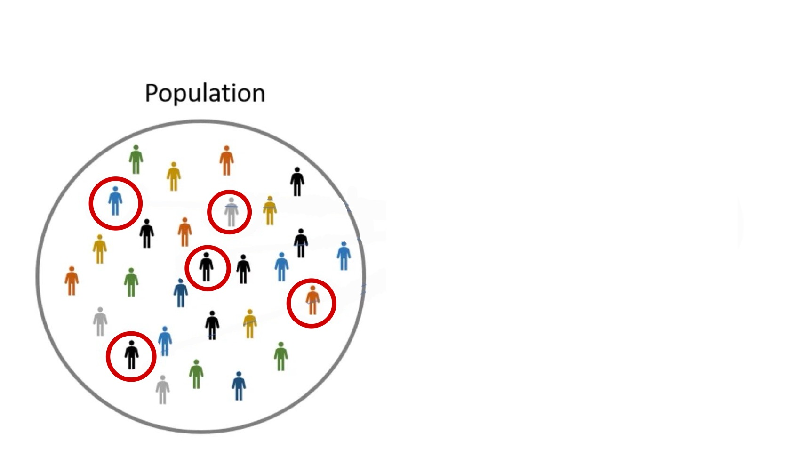{width=75%}
:::
:::

::: {.fragment .absolute top=200px left=350px}
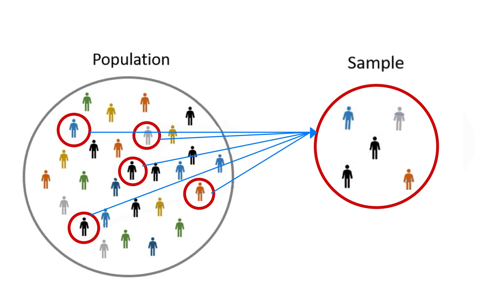{width=75%}
:::

## Sample Cont.

:::{.absolute top=200px left=350px}
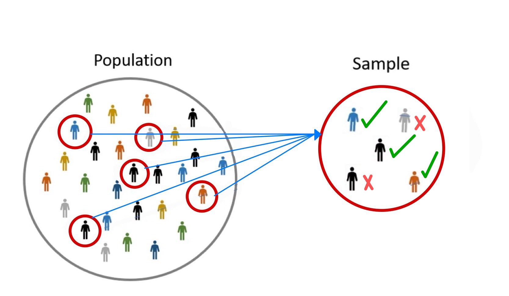{width=75%}
:::

:::{.absolute top=50px}
:::{.callout-tip title="Example" style="font-size:1.15em;"}
Lets return to our previous example. Suppose a majority of the sample says they would be interested in using a new on-campus service that is launching. [Does this guarantee the majority of the population will be interested in using the new on-campus service that is launching?]{.underline .fragment}
:::
:::

:::{.fragment .absolute bottom=65px}
[[*Solution*]{.underline}: No! This result is just based off one sample. We can never say something in a sample guarantees something in the population. [Remember, we will only know everything about a population if & only if we take a *census*]{.subtext}]{.mysolution}
:::

:::{.fragment .absolute top=620px}
- If we took another sample, are we going to get the exact same results?
:::

::::{.fragment} 
:::{.absolute top=200px left=350px}
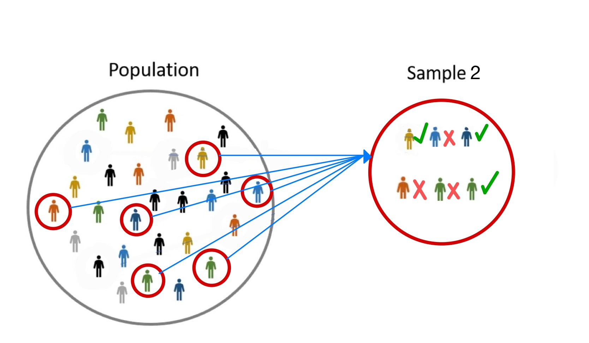{width=75%}
:::

:::{.absolute top=50px}
:::{.callout-tip title="Example" style="font-size:1.15em;"}
Lets return to our previous example. Suppose a majority of the sample says they would be interested in using a new on-campus service that is launching. [Does this guarantee the majority of the population will be interested in using the new on-campus service that is launching?]{.underline}
:::
:::

:::{.absolute bottom=65px}
[[*Solution*]{.underline}: No! This result is just based off one sample. We can never say something in a sample guarantees something in the population. [Remember, we will only know everything about a population if & only if we take a *census*]{.subtext}]{.mysolution}
:::

:::{.absolute bottom=22px right=0px}
[Most likely not!]{.mysolution}
:::

::::

## Why Statistics is Hard

::: {.incremental}
- In statistics we are trying to solve a really hard and nearly impossible problem
  - **Goal**: Infer something about the population given just one sample
:::

::::{.fragment .absolute top=150px}
:::{.callout-tip title="Example" style="font-size:1.15em;"}
Suppose two students are each given a few puzzle pieces and are asked to guess what the puzzle is about.
:::
::::

::::{.fragment}
:::{.absolute top=275px width=225px left=250px}

:::

:::{.absolute top=275px width=225px right=250px}

:::
:::

:::{.incremental .absolute bottom=50px}
- Student 1 claims the puzzle makes an ocean
- Student 2 claims the puzzle makes the sky
:::

::: {.fragment .absolute bottom=0px left=350px }
Which student is correct??
:::

## Why Statistics is Hard Cont. 

- Again, it is impossible to know without taking a *census*

::: {.center}
{width=20%}
:::

:::{.incremental .absolute top=400px}
- Both students were partially correct and made reasonable inference based off their puzzle pieces (data)
- Now imagine the total number of puzzle pieces is in the millions, billions, or even trillions. This becomes a very hard problem!
  - [This is what we are dealing with in statistics. Using a relatively small sample to make inference about an entire population]{style=font-size:.85em;"} 
<!--  - [Our goal is to make a reasonable inference based upon our data while considering the practical implications]{style=font-size:.85em;"} -->
:::

# Data and Statistics

## What is Data? 
:::{.incremental}
- To understand data manipulation, visualization, and applied methodology, we must understand what we mean by "data"
- **Data** *is generally any collection of information*
:::

:::{.incremental}
- In statistics, generally, data consist of $n$ observations and $p$
variables [(features)]{.subtext} 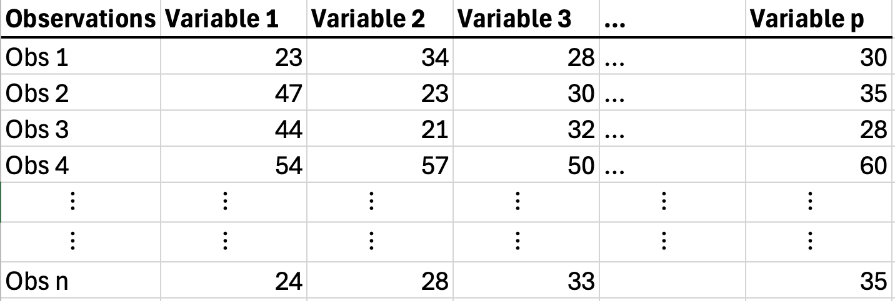{.center width=75%}
  - Data is often collected in spreadsheet form via .csv files [(Comma Separated Values)]{.subtext}
:::

## What is Data? Cont. 

:::{.callout-tip  title="Example" style="font-size:1.15em;"}
Algorithm stock trading has risen in popularity with AI, however the "buy and hold" strategy often still outperforms algorithms. Thus, is it possible to determining good stocks to "buy and hold"  by just a companies 10-k filings? We consider stock return data for a companys' previous 2017 10-k filing with their 2018 end of year stock return.
:::

:::{.center}
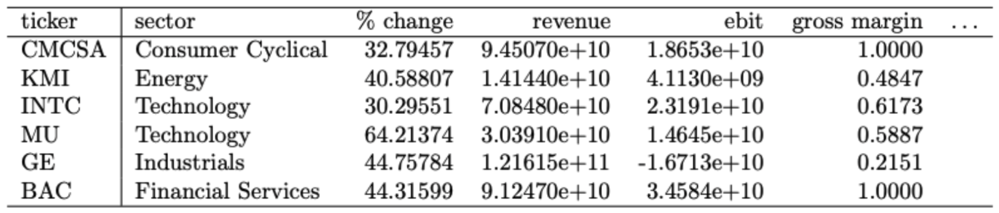{width=75%}
:::

:::{.fragment}
- 2, 716 stocks or companies 
:::

:::{.fragment .absolute top=500px left=375px}
[sample size is n = 2,716]{.mysolution}
:::

:::{.fragment .absolute top=535px}
- 103 variables (features) consisting of 10-k filing statement metrics 
:::

:::{.fragment .absolute top=535px right=140px}
[p = 103]{.mysolution}
:::

:::{.absolute top=575px .fragment}
- The target variable of interest is the % Change (stock return)
:::

## Branches of Statistics
- The field of statistics can be generalized into two categories

:::{.absolute top=150px left=400px}
::: {style="width:200px;height:100px;background:transparent;border:4px solid; color:#bf5700;"}
:::
:::

:::{.absolute top=175 left=450}
**Statistics**
:::

:::{.fragment}

:::{.absolute top=200px left=300px}
::: {style="width:100px;height:0px;background:transparent;border:2px solid;"}
:::
:::

:::{.absolute top=200px right=340px}
::: {style="width:100px;height:0px;background:transparent;border:2px solid;"}
:::
:::


:::{.absolute top=275px right=265px}
::: {style="width:150px;height:0px;background:transparent;border:2px solid;transform:rotate(90deg);"}
:::
:::

:::{.absolute top=275px left=225px}
::: {style="width:150px;height:0px;background:transparent;border:2px solid;transform:rotate(90deg);"}
:::
:::


:::{.absolute top=350px left=200px}
::: {style="width:200px;height:100px;background:transparent;border:4px solid; color:#bf5700;"}
:::
:::

:::{.absolute top=350px right=240px}
::: {style="width:200px;height:100px;background:transparent;border:4px solid; color:#bf5700;"}
:::
:::

:::{.absolute top=375 left=235}
**Descriptive**
:::


:::{.absolute top=375 right=275 }
**Inferential**
:::
:::

:::{.fragment}

:::{.absolute top=502px left=255px}
::: {style="width:90px;height:0px;background:transparent;border:2px solid;transform:rotate(90deg);"}
:::
:::

:::{.absolute top=550px left=200px}
::: {style="width:200px;height:100px;background:transparent;border:4px solid; color:#bf5700;"}
:::
:::

:::{.absolute top=545px left=195px}
:::{style="font-size:.60em;"}
- **Collecting (Mining) Data**
- **Processing Data**
- **Visualizing Data**
- **Summarizing Data**
:::
:::

:::

:::{.fragment .absolute width=28% top=450 right=835}
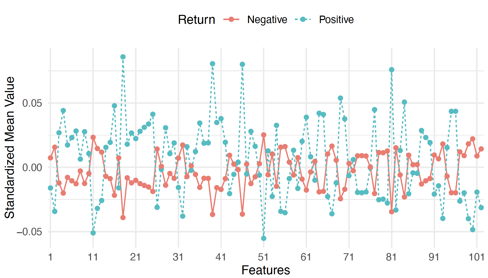
:::

:::{.fragment}

:::{.absolute top=545px right=245px}
:::{style="font-size:.65em;"}
- **Making inferences and** <br>
**drawing conclusions** <br> **from data**
:::
:::

:::{.absolute top=502px right=295px}
::: {style="width:90px;height:0px;background:transparent;border:2px solid;transform:rotate(90deg);"}
:::
:::


:::{.absolute top=550px right=240px}
::: {style="width:200px;height:100px;background:transparent;border:4px solid; color:#bf5700;"}
:::
:::
:::

:::{.fragment .absolute width=35% bottom=120 left=800}
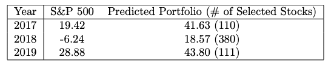
:::

## Types and Sources of Data

The methods and analyses we apply to data and the conclusions we can draw depend on: 

:::{.incremental}
- What kind of data we have
  - Is it qualitative or quantitative?
  - On what scale was the data measured?
:::


:::{.incremental}
- Where or how we obtained our data
  - Is it experimental or observational?
  - Is it population (census) data or just from a sample?
:::  

:::{.incremental}
- This is for both Descriptive & Inferential statistics
  - Different data types will require different graphs and different analyses
:::

## Types and Sources of Data Cont. 
- **Qualitative data** 
- **Quantitative data**

:::{.fragment data-fragment-index="1" .absolute top=100px width=300px left=0px}

:::

:::{.fragment .absolute top=290px .fade-down data-fragment-index="1"}
- **Quantitative data**
:::

:::{.fragment .absolute top=72px left=258px data-fragment-index="1"}
*is data that is categorical in nature* [also referred to as just categorical data]{.subtext}
:::

:::{.fragment .absolute top=120px .subbullets}
- True/False, Male/Female
- College (Engineering, Business, Natural Sciences)
- Education level (High school, Bachelor's, Master's, PhD)
:::

::::{.fragment}
:::{.absolute top=205px left=745px}
[\}]{style="font-size:2em;"} 
:::

:::{.absolute top=202px left=770px}
**ordinal data** *has meaning in the order* 
:::
::::

::::{.fragment}
:::{.absolute top=95px left=665px}
[\}]{style="font-size:4em;"} 
:::

:::{.absolute top=152px left=700px}
**nominal data** *has no ordering* 
:::
::::

:::{.fragment  .absolute top=290px left=275px}
*is data that is numerical in nature* 
:::

:::{.fragment .absolute top=330px .subbullets}
- Currency ($, &yen;, and ect.)
- Height, weight, distance, time, and ect.
:::

:::{.fragment .subbullets .absolute top=430px}
- Number of ...
  - Sales made
  - deaths 
  - followers gained
:::

::::{.fragment}
:::{.absolute top=295px left=565px}
[\}]{style="font-size:4em;"} 
:::

:::{.absolute top=352px left=600px}
**Continuous data** *is NOT countable* 
:::
::::

::::{.fragment}
:::{.absolute top=395px left=365px}
[\}]{style="font-size:6.5em;"} 
:::

:::{.absolute top=500px left=418px}
**Discrete data** *is countable*
:::
::::

## Types and Sources of Data Cont. 

Example with shoes size and one more

## Measures of Data: Parameter vs Statistic 
- When we take a measure of data, we are dealing with either a *parameter* or a *statistic*

::::{.fragment}
:::{.absolute top=120px}
- **Parameter**: *a measure of the population*
:::

:::{.absolute width=600px top=350px left=250px}

:::

:::{.fragment .absolute width=600px top=350px left=250px}
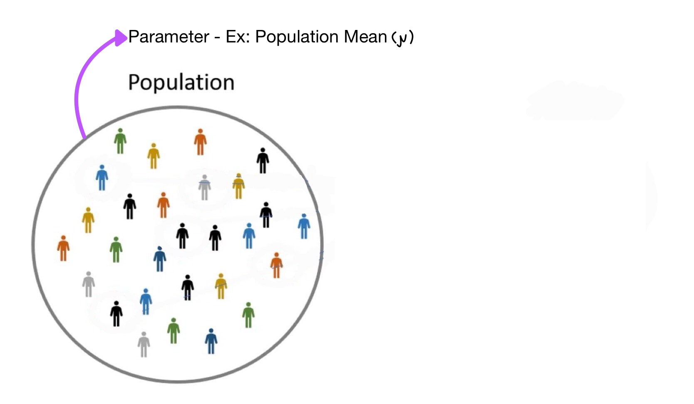
:::

::::

:::{.fragment .subbullets .absolute top=165px}
- A fixed value (constant) and generally unknown
:::

:::{.fragment .subbullets .absolute top=205px}
- When is a parameter known? [[Only when a census is taken!]{.mysolution}]{.fragment}
:::
  

:::{.fragment .absolute top=265px}
- **Statistic**: *a measure of the sample*
:::


:::{.fragment .absolute width=600px top=350px left=250px}
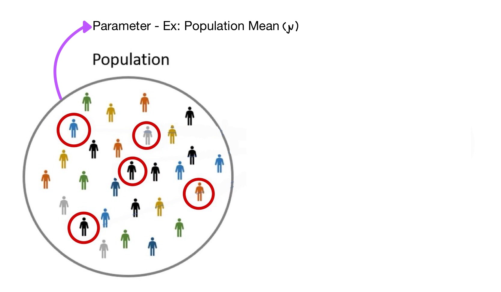
:::

:::{.fragment .absolute width=600px top=350px left=250px}
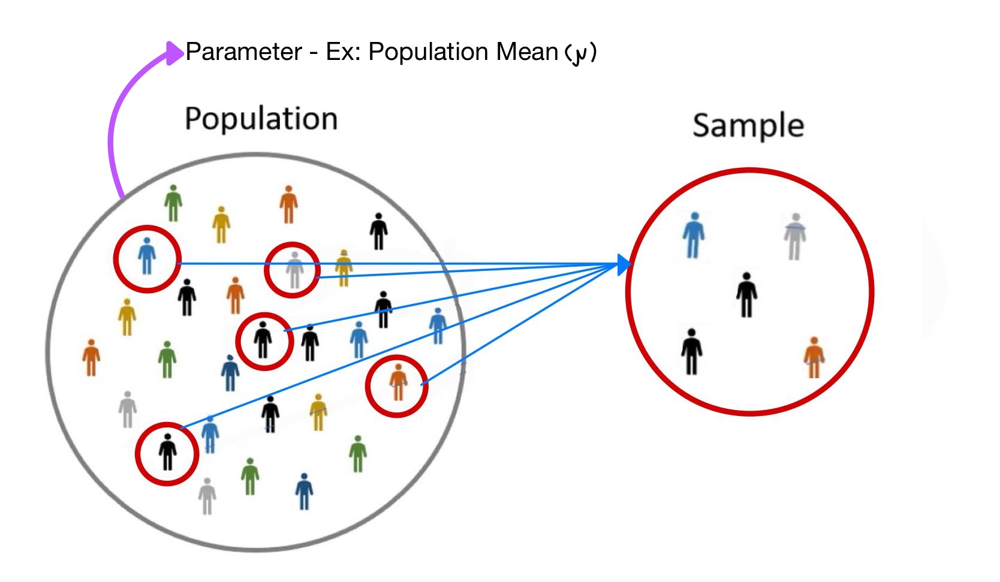
:::

:::{.fragment .absolute width=600px top=350px left=250px}
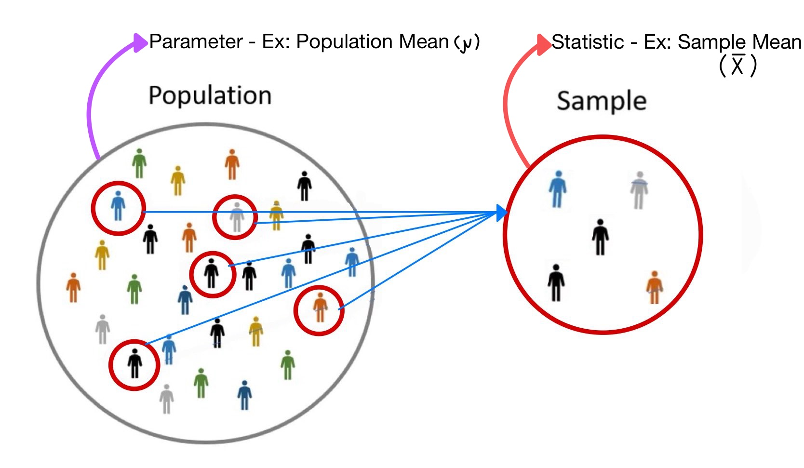
:::

  
:::{.fragment .subbullets .absolute top=305px}
- A *random variable*, i.e. it will vary from sample to sample
:::  
  
  
:::{.fragment .absolute top=345px left=325px}
[A statistic estimates the parameter]{.mysolution}
:::

:::{.fragment}  


:::{.absolute width=600px top=350px left=250px}
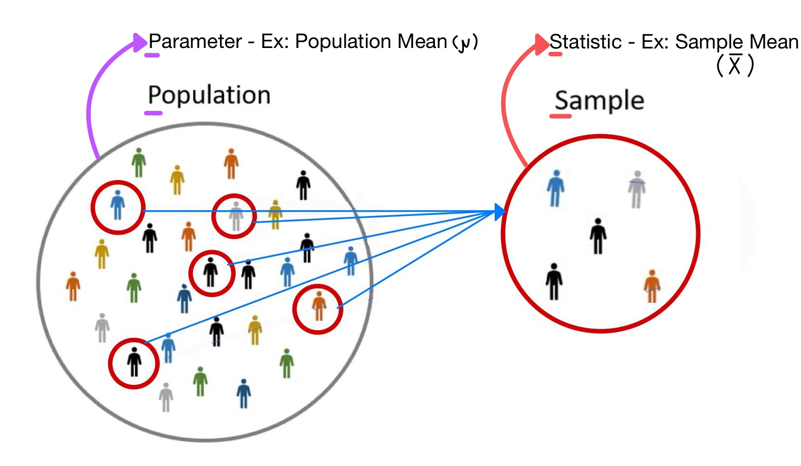
:::

:::{.absolute top=345px left=325px}
[A statistic estimates the parameter]{.mysolution}
:::

:::{.absolute top=350px left=315px style="width:420px; height:40px; border:2px solid red;" .mysolution}
:::

:::

:::{.fragment .absolute top=250px right=850px width=500px style="transform:rotate(-90deg); font-size:1.25em;"}
[VERY IMPORTANT SLIDE]{.mysolution}
:::

# Descriptive Statistics

## Measures of Data: Central Location
- Measure of central location describe the "typical" value in a dataset

:::{.fragment .subbullets .absolute top=120px}
  - Mean (Arithmetic) `mean()`
  - Median `median()`
  - Mode `DescTools::Mode()`
  - Geometric Mean `DescTools::GeoMean()`
:::

## Measures of Data: Mean
- **Mean** (Arithmetic): *average value of data* 

:::{.center}
::: columns
::: {.column width="35%"}
Population Mean 

$$\mu = \sum_{i = 1}^{N}\frac{X_{i}}{N}$$
:::

::: {.column width="3%"}
:::

::: {.column width="62%"}
Sample Mean 

$$\overline{x} = \sum_{i = 1}^{n}\frac{x_{i}}{n}$$
:::
:::
:::

:::{.fragment}
```{webr}
data <- c(1, 2, 2, 5, 6)
mean(data)
```
:::

:::{.fragment .center}
[We use $\bar{x}$ to estimate $\mu$]{.mysolution}
:::

## Measures of Data: Median
- **Median**: middle value of data 
  
```{webr}
data <- c(1, 2, 2, 5, 6)
median(data)
```

:::{.fragment}
- If # of observations is even, then the median is average of the two middle values
```{webr}
data_2 <- c(1, 2, 5, 6) # Even number of observations
median(data_2)
(2+5)/2
```
:::

## Measures of Data: Mean vs Median
:::{.incremental}
- Mean and Median both describe the "typical" value or center of a dataset
  - Why use both? or When is one preferred?
:::

:::{.fragment .callout-tip title="Example" style="font-size:1.25em;"}
Ex: Suppose as a real estate investor, we are interested in evaluating a newly built neighborhood.

:::{.center}
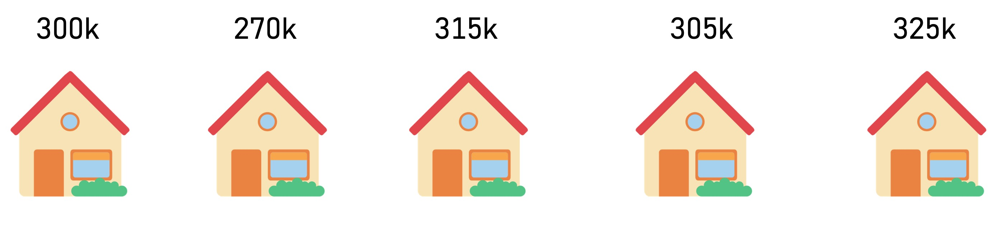{width=75%}
:::

We determine the Mean is \$303,000 and the Median is \$305,000. Which measure should we use to describe the "typical" value of a home in the neighborhood?
:::

:::{.fragment .absolute top=615}
[[*Solution*]{.underline}: In this case both the mean and median are about the same, so there is no preference.]{.mysolution} 
:::

## Measures of Data: Mean vs Median

:::{.center}
What if we changed the value of one of the homes?
:::


::::{.fragment}

:::{.absolute top=100px}
:::{.callout-tip title="Example" style="font-size:1.25em;"}
Ex: Suppose as a real estate investor, we are interested in evaluating a newly built neighborhood.

:::{.center}
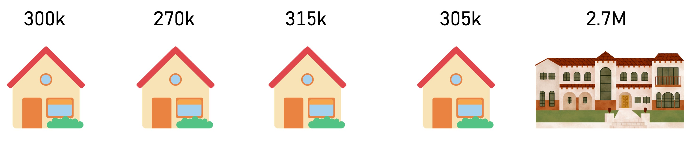{width=75%}
:::

We determine the Mean is [\$303,000]{style="color:#D3D3D3;"} and the Median is [\$305,000]{style="color:#D3D3D3;"} Which measure should we use to describe the "typical" value of a home in the neighborhood?
:::
:::
::::

::::{.fragment}

:::{.absolute top=100px}
:::{.callout-tip title="Example" style="font-size:1.25em;"}
Ex: Suppose as a real estate investor, we are interested in evaluating a newly built neighborhood.

:::{.center}
{width=75%}
:::

We determine the Mean is [\$778,000]{.mysolution} and the Median is [\$305,000]{.mysolution} Which measure should we use to describe the "typical" value of a home in the neighborhood?
:::
:::
::::

:::{.fragment .absolute top=525px}
[[*Solution*]{.underline}: In this case, the median best represents the "typical" value of a home in the neighborhood. This is because the mean is inflated by the outlier.]{.mysolution}
:::

:::{.absolute top=605px .incremental}
- **Resistant Measure** - A measure that is not affected by outliers
  - The median is a resistant measure but the mean is not
:::

## Measure of Data: Locations

:::{.incremental}
- **Percentile**: The $m^{\text{th}}$ percentile, $P_{m}$, is the value $x$ such that $m\%$ of the data values are less than $x$ and $(100 - m)\%$ are greater than $x$. 
  <!--- The mean and median provide measure of the central location of data-->
  - percentile provide measure of specific locations
:::

:::{.fragment .callout-tip title="Question" style="font-size:1.25em;"}
If you have your IQ tested, would you rather be told you are in the $98^{\text{th}}$ percentile or the $2^{\text{nd}}$ percentile?
:::

:::{.fragment}
[[*Solution*]{.underline}: The $98^{\text{th}}$ percentile because this means you have an IQ higher than 98% of all others.]{style="font-size:.8em" .mysolution}
:::

:::{.fragment}
```{webr}
data <- c(1, 2, 2, 4, 5, 6)
quantile(data, probs = 0.98)
```
:::

## Measure of Data: Locations Cont.

:::{.incremental}
- **Quartiles**: percentiles that divides the data into quarters
  - $Q_{1} = P_{25}$
  - $Q_{2} = P_{50}$ [[median]{.mysolution}]{.fragment}
  - $Q_{3} = P_{75}$
::: 

:::{.fragment}
```{webr}
data <- c(1, 2, 2, 4, 5, 6)
quantile(data, probs = c(0.25, 0.50, 0.75))
```
:::


## Measures of Data: Variability
- **Variance**: average value the data varies from the mean in $\text{units}^{2}$

:::{.center}
::: columns
::: {.column width="35%"}
[Population Variance ]{style="font-size:.8em;"}

[$$\sigma^2 = \frac{\sum_{i = 1}^{N}(X_{i} - \mu)^{2}}{N}$$]{style="font-size:.8em;"}
:::

::: {.column width="3%"}
:::

::: {.column width="62%"}
[Sample Variance]{style="font-size:.8em;"}

[$$s^2 = \frac{\sum_{i = 1}^{N}(x_{i} - \bar{x})^{2}}{n - 1}$$]{style="font-size:.8em;"}
:::
:::
:::

:::{.fragment}
:::{style="transform: scale(0.80); transform-origin: top left; width: 120%;"}
```{webr}
data <- c(1, 2, 2, 4, 5, 6)
var(data)
```
:::
:::

:::{.fragment}
:::{.absolute top=430px}
- **Standard Deviation**: square root of variance [i.e. average value the data varies from the mean in actual units]{.subtext}
:::

::: {.absolute top=490px left=100px}
[Population Standard Deviation]{style="font-size:.8em;"}

[$$\sigma = \sqrt{\sigma^{2}}$$]{style="font-size:.8em;"}
:::


::: {.absolute top=490px right=140px}
[Sample Standard Deviation]{style="font-size:.8em;"}

[$$s = \sqrt{s^{2}}$$]{style="font-size:.8em;"}
:::

:::

:::{.fragment .absolute top=600px style="transform: scale(0.80); transform-origin: top left; width: 120.33%;"}
```{webr}
#| include: false
data <- c(1, 2, 2, 4, 5, 6)
```
```{webr, collapse=TRUE}
sd(data)
sqrt(var(data)) #i.e. sqrt(3.867) from above
```
:::


## Measures of Data: Variability 

- **Inner Quartile Range (IQR)**: variability of the middle 50\% of data values 
$$IQR = Q_{3} - Q_{1}$$

:::{.fragment style="transform: scale(0.70); transform-origin: top left; width: 133.33%;"}
```{webr}
data <- c(1, 2, 2, 4, 5, 6)
IQR(data)
```
:::

```{webr}
#| include: false
data <- c(1, 2, 2, 4, 5, 6)
```

:::{.fragment style="transform: scale(0.70); transform-origin: top left; width: 133.33%;"}
```{webr}
# same as IQR()
quantile(data, probs = 0.75) - quantile(data, probs = 0.25) 
```
:::

:::{.incremental}
- Which is measure of variability is a resistant measure? 
  - Variance/Standard Deviation [[❌]{.fragment}]{.mysolution}
  - IQR [[✅]{.fragment}]{.mysolution}
:::

# Bivariate Descriptive Statistics

## Bivariate Data

:::{.incremental}
- The past measures are for one variable [[i.e univariate data]{.fragment}]{.mysolution}

:::{.fragment style="font-size:.7em;"}
```{r, echo=FALSE}
set.seed(1)
X <- round(rnorm(5), 2)
tibble("X" = X) |> 
  knitr::kable()
```
:::

:::{.fragment .absolute top=150px left=60%}
$\mu_{X}$ = `{r} mean(X)`

$\sigma_{X}$ = `{r} var(X)`
:::

- However, we are often interested in how one variable varies with another
- When we have two variables we say we have **bivariate data**

:::{.fragment style="font-size:.75em;"}
```{r, echo=FALSE}
set.seed(1)
tibble("X" = round(rnorm(5), 2), 
       "Y" = round(runif(5), 2)) |> 
  knitr::kable()
```
:::

:::{.fragment .absolute top=80% left=60%}
Relationship between X and Y = ??
:::

:::


## Measures of Data: Variability Between Two Variables

- **Covariance**: measure of the [*linear*]{.underline} variability between two variables $X$ and $Y$ 

:::{.center}
$\sigma_{xy} = Cov(X, Y) = \frac{\sum_{i = 1}^{N}(X_{i} - \mu_{x})(Y_{i} - \mu_{y})}{N}$
:::

:::{.fragment}
- [$+$]{style="color:green;"} Covariance: when X is above its mean, Y also tends to be above its mean [i.e they move in the same direction]{.subtext}

:::{style="font-size:.7em;"}
```{r, eval=FALSE}
#| code-fold: true
#| code-summary: "Show code"

set.seed(1) # random number generator seed
X <- rnorm(10) # random 10 numbers
Y <- 5*X + rnorm(10) # Y is 5 times X plus a little error
ggplot(aes(X, Y), data = NULL)+
  geom_smooth(se = FALSE, color = "green", method = "lm")+
  geom_point()
```
:::

```{r, echo=FALSE, fig.height=3.25}
set.seed(1) # random number generator seed
X <- rnorm(10) # random 10 numbers
Y <- 5*X + rnorm(10) # Y is 5 times X plus a little error
ggplot(aes(X, Y), data = NULL)+
  geom_smooth(se = FALSE, color = "green", method = "lm")+
  geom_point()
```
:::

:::{.fragment .absolute top=36% left=10% style="transform: scale(0.70);"}
```{webr}
set.seed(1) # random number generator seed
X <- rnorm(10) # random 10 numbers
Y <- 5*X + rnorm(10) # Y is 5 times X plus a little error
cov(X, Y)
```

:::

## Covariance Cont.
- [$-$]{style="color:red;"} Covariance: when X is above its mean, Y tends to be below its mean [they move in opposite directions]{.subtext}

:::{style="font-size:.7em;"}
```{r, eval=FALSE}
#| code-fold: true
#| code-summary: "Show code"

set.seed(1) # random number generator seed
X <- rnorm(10) # random 10 numbers
Y <- -3*X + rnorm(10) # Y is - 3 times X plus a little error
ggplot(aes(X, Y), data = NULL)+
  geom_smooth(se = FALSE, color = "red", method = "lm")+
  geom_point()
```
:::

:::{.center}
```{r, echo=FALSE, fig.height=3.25}
set.seed(1) # random number generator seed
X <- rnorm(10) # random 10 numbers
Y <- -3*X + rnorm(10) # Y is - 3 times X plus a little error
ggplot(aes(X, Y), data = NULL)+
  geom_smooth(se = FALSE, color = "red", method = "lm")+
  geom_point()
```
:::

:::{.fragment .absolute top=75% left=10% style="transform: scale(0.70);"}
```{webr}
set.seed(1) # random number generator seed
X <- rnorm(10) # random 10 numbers
Y <- -3*X + rnorm(10) # Y is - 3 times X plus a little error
cov(X, Y) # negative covariance
```
:::

## Covariance Cont.
- [Zero]{style="color:grey;"} Covariance: deviations of X from its mean give no linear information about deviations of Y from its mean.

:::{style="font-size:.7em;"}
```{r, eval=FALSE}
#| code-fold: true
#| code-summary: "Show code"

set.seed(1) # random number generator seed
X <- rnorm(25) # random 10 numbers
Y <- rnorm(25) # another random 10 numbers
ggplot(aes(X, Y), data = NULL)+
  geom_hline(yintercept = 0, color = "grey")+
  geom_point()
```
:::

:::{.center}
```{r, echo=FALSE, fig.height=3.25}
set.seed(1) # random number generator seed
X <- rnorm(25) # random 10 numbers
Y <- rnorm(25) # another random 10 numbers
ggplot(aes(X, Y), data = NULL)+
  geom_hline(yintercept = 0, color = "grey")+
  geom_point()
```
:::

:::{.fragment .absolute top=75% left=10% style="transform: scale(0.70);"}
```{webr}
set.seed(1) # random number generator seed
X <- rnorm(25) # random 25 numbers
Y <- rnorm(25) # another random 25 numbers
cov(X, Y) # close to zero, so very little covariance
```
:::

## Issue with Covariance

:::{style="font-size:.9em;" data-fragment-index="1" .fragment}
- *Reminder*: Covariance tells us whether two variables are linear related and in which direction
  - [But what does covariance tell us about the strength of the relationship?]{data-fragment-index="2" .fragment}
:::

:::{.fragment .callout-tip title="Example" style="font-size:1.1em;" data-fragment-index="3"}
Suppose a company wants to determine whether the delivery time (in hours) or price of a product (in \$'s) has a stronger relationship with units sold. [Which variable has a stronger relationship with units sold?]{.underline .fragment  data-fragment-index="5"}
:::

:::{.fragment data-fragment-index="4"}
<!-- :::{style="font-size: .5em"} -->
<!-- ```{r, eval=FALSE} -->
<!-- #| code-fold: true -->
<!-- #| code-summary: "Show code" -->

<!-- set.seed(42) -->
<!-- n <- 300 -->

<!-- # Delivery time has wide spread but weaker effect -->
<!-- delivery_time <- rnorm(n, mean = 96, sd = 10) -->
<!-- # Price has narrow spread but stronger effect -->
<!-- price <- rnorm(n, mean = 20, sd = 2) -->
<!-- # Units sold responds more strongly to price -->
<!-- units_sold <- 2000 - 10*price - .25*delivery_time + rnorm(n, 0, 25) -->

<!-- tibble("Delivery Time" = delivery_time,  -->
<!--        "Price" = price,  -->
<!--        units_sold) |>  -->
<!--   pivot_longer(-units_sold, names_to = "variable") |>  -->
<!--   ggplot(aes(value, units_sold))+ -->
<!--   geom_point()+ -->
<!--   geom_smooth(aes(color = variable), method = "lm", se = FALSE)+ -->
<!--   facet_wrap(~variable, scales= "free_x")+ -->
<!--   labs(x = "Value", y = "Units Sold")+ -->
<!--   theme(strip.background = element_rect(fill = "lightgrey"))+ -->
<!--   guides(color = "none") -->
<!-- ``` -->
<!-- ::: -->

:::{style="font-size: .7em"}
::: panel-tabset

### Plot

:::{.center}

```{r, fig.height=3.2, fig.width=8, echo=FALSE}
set.seed(42)
n <- 300

# Delivery time has wide spread but weaker effect
delivery_time <- rnorm(n, mean = 96, sd = 10)
# Price has narrow spread but stronger effect
price <- rnorm(n, mean = 20, sd = 2)
# Units sold responds more strongly to price
units_sold <- 2000 - 10*price - .25*delivery_time + rnorm(n, 0, 25)

p <- tibble("Delivery Time" = delivery_time, 
       "Price" = price, 
       units_sold) |> 
  pivot_longer(-units_sold, names_to = "variable") |> 
  ggplot(aes(value, units_sold))+
  geom_point()+
  geom_smooth(aes(color = variable), method = "lm", se = FALSE)+
  facet_wrap(~variable, scales= "free_x")+
  labs(x = "Value", y = "Units Sold")+
  theme(strip.background = element_rect(fill = "lightgrey"))+
  guides(color = "none")
p
```

:::

### Data

```{r, echo = FALSE}
tibble("Delivery Time" = delivery_time, 
       "Price" = price, 
       "Units Sold" = units_sold) |> 
  head() |> 
  knitr::kable()
```
:::

:::

:::


:::{.fragment .absolute top=45% left=15% style="font-size:.8em;"}
[[*Solution:*]{.underline} Visually, Price has more of linear relationship with Units Sold than Delivery Time]{.mysolution}
:::

## Issue with Covariance Cont.

:::{.center}
```{r, fig.height=2.5, echo=FALSE}
p
```
:::

:::{.callout-tip title="Question"}
Since [price]{.mysolution} had a visually stronger relationship with units sold, which variable would we expect to have a larger covariance magnitude? [[[Solution:]{.underline} Theoretically, Price should have a larger covariance magnitude because it has a stronger relationship.]{.fragment data-fragment-index="1"}]{.mysolution}
:::

:::{.fragment data-fragment-index="2" style="font-size:.8em;"}
But... [[Delivery time has a larger covariance magnitude compared to price ?]{.fragment data-fragment-index="5"}]{.mysolution}
:::

:::{.fragment data-fragment-index="2" style="font-size:.8em;"}
```{r, eval=FALSE}
cov(price, units_sold)
```
```{r, echo=FALSE, results='hide'}
answer1 <- cov(price, units_sold)
```
:::

:::{.fragment .mysolution data-fragment-index="3" style="font-size:.8em;"}
[1] `{r} round(answer1, 2)`
:::

:::{.fragment data-fragment-index="2" style="font-size:.8em;"}
```{r, eval=FALSE}
cov(delivery_time, units_sold)
```
```{r, echo=FALSE, results='hide'}
answer2 <- cov(delivery_time, units_sold)
```
:::

:::{.fragment .mysolution data-fragment-index="4" style="font-size:.8em;"}
[1] `{r} round(answer2, 2)`
:::

## Correlation
:::{.incremental}
- Covariance tells the direction of the relationship between variables, but we can not compare covariances unless they are in the same units 
  - However, we can "standardize" the covariances to make them comparable
:::

:::{.incremental}
- **Correlation**: "Standardized" measure of the [*linear*]{.underline} variability between two variables $X$ and $Y$
$$\rho_{XY} = \frac{Cov(X, Y)}{\sqrt{\sigma_{x}^{2}\times\sigma_{y}^{2}}},$$
where  $- 1\leq \rho_{XY} \leq 1$.  `cor()` in R [sample correlation is denoted r]{.subtext}
  - $-1 \leq \rho < 0$ indicates a [negative]{style="color:red;"} linear relationship
  - $0 < \rho \leq 1$ indicates a [positive]{style="color:green;"} linear relationship
  - $\rho = 0$ indicates no [linear]{.underline} relationship
  - $\pm 1$ indicates a perfect negative or positive linear relationship
::: 


## Correlation Example

:::{.center}
```{r, fig.height=2.5, echo=FALSE}
p
```
:::

:::{.fragment}
Now, from our previous example,... 

```{webr}
#| include: false

set.seed(42)
n <- 300

# Delivery time has wide spread but weaker effect
delivery_time <- rnorm(n, mean = 96, sd = 10)
# Price has narrow spread but stronger effect
price <- rnorm(n, mean = 20, sd = 2)
# Units sold responds more strongly to price
units_sold <- 2000 - 10*price - .25*delivery_time + rnorm(n, 0, 25)
```


```{webr}
cor(price, units_sold)
cor(delivery_time, units_sold)
```
:::

:::{.fragment .mysolution}
Correlation correctly indicates Price has a stronger linear relationship with Units Sold. 
:::

## Correlation Cont.
:::{style="font-size:.8em;"}
- Correlation and Covariance only measure the [linear]{.underline} relationship between two variables. 
:::

:::{.fragment .callout-tip title="Example" .fragment data-fragment-index="1"}
Consider the variables X1 and X2 and their relationship with Y. [Which variable has a stronger relationship with Y?]{.fragment data-fragment-index="2" .underline}
:::

<!-- [Solution: X1 and Y have almost a perfect quadratic relationship, while X2 and Y have practically no relationship.]{style="color:white;font-size:.85em; "} -->

:::{.fragment .fragment data-fragment-index="1"}
:::{style="font-size: .5em"}
```{r, results='hide'}
#| code-fold: true
#| code-summary: "Show code"
set.seed(1)
X1 <- rnorm(100, mean = 0)
Y <- X1^2 + rnorm(100, sd = 0.01)
X2 <- (Y - rnorm(100, sd = 5))/5

p1 <- ggplot(aes(X1, Y), data = NULL)+
  geom_point()
p2 <- ggplot(aes(X2, Y), data = NULL)+
  geom_point()
library(patchwork)
p <- p1+p2
```
:::

:::{.center}
```{r, fig.height=3.5, echo=FALSE}
p
```
:::
:::

:::{.fragment .absolute top=32% left=10% style="font-size:.8em;"}
[[*Solution:*]{.underline} X1 and Y have almost a perfect quadratic relationship, while X2 and Y have practically no relationship.]{.mysolution}
:::

:::{.fragment}
```{r, echo=FALSE}
set.seed(1)
X1 <- rnorm(100, mean = 0)
Y <- X1^2 + rnorm(100, sd = 0.01)
X2 <- (Y - rnorm(100, sd = 5))/5
```

:::{.absolute top=265 left=250}
```{r, eval=FALSE}
cor(X1, Y)
```
```{r, echo=FALSE}
answer1 <- cor(X1, Y)
```
:::

:::{.absolute top=285 left=260}
[[1] `{r} round(answer1, 4)`]{.mysolution style="font-size:.7em;"}
:::

:::{.absolute top=265 right=250}
```{r, eval=FALSE}
cor(X2, Y)
```
```{r, echo=FALSE}
answer2 <- cor(X2, Y)
```
:::

:::{.absolute top=285 right=350}
[[1] `{r} round(answer2, 4)`]{.mysolution style="font-size:.7em;"}
:::

[However, correlation can only detect linear relationships. [[Thus, X1 and Y have a smaller correlation.]{.fragment}]{.mysolution}]{style="font-size: .8em"}
:::

## Correlation vs Causation

- Correlation only indicates a linear relationship between two variables and does [not]{.underline} imply one variable causes the other 

:::{.fragment}
- Correlation can imply silly relationships

:::{.center}
{preview-link="true"}](figures/silly_cor.png){width=60%}
:::

:::

##  Correlation vs Causation Cont.

:::{.incremental}
- Unintentional correlation is often due to a *confounding* variable (Z)
- **Confounding Variable**: a variable that affects both X and Y, making them appear related even if there is no direct connection.

:::{.center .fragment}
{preview-link="true"}](figures/smoking.png){width=60%}
:::

- **Causal Inference** refers to determining the causal relationship (if there is any) between X and Y, while properly adjusting for the confounder Z

:::

# The End {visibility="uncounted"}