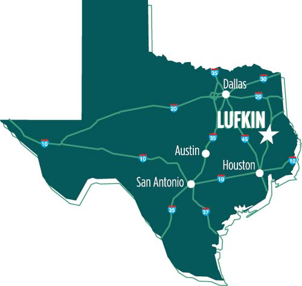
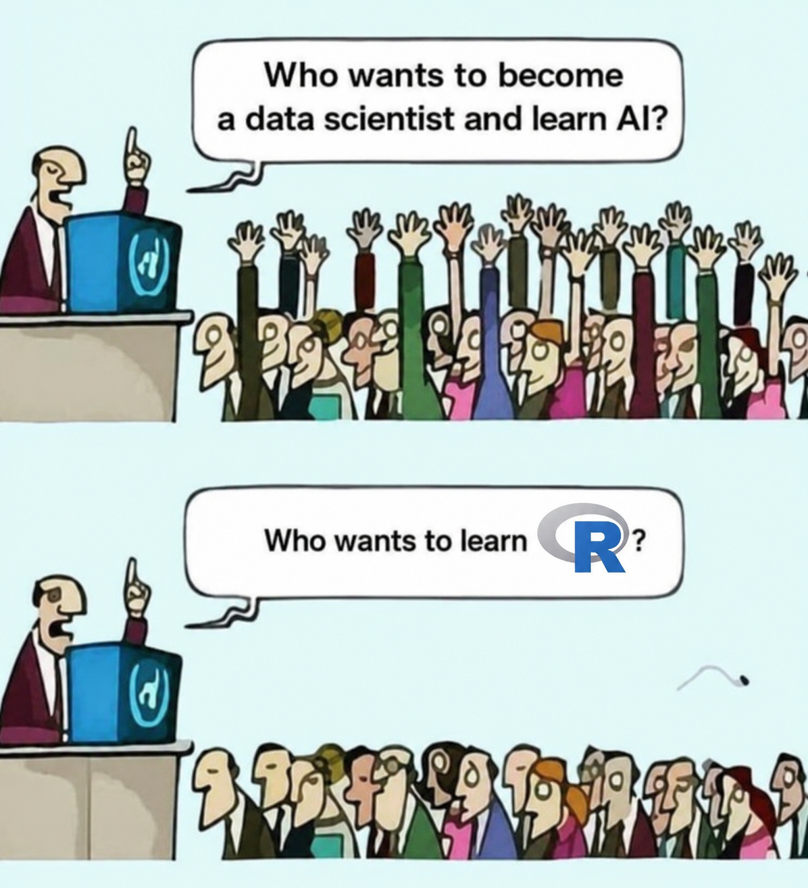
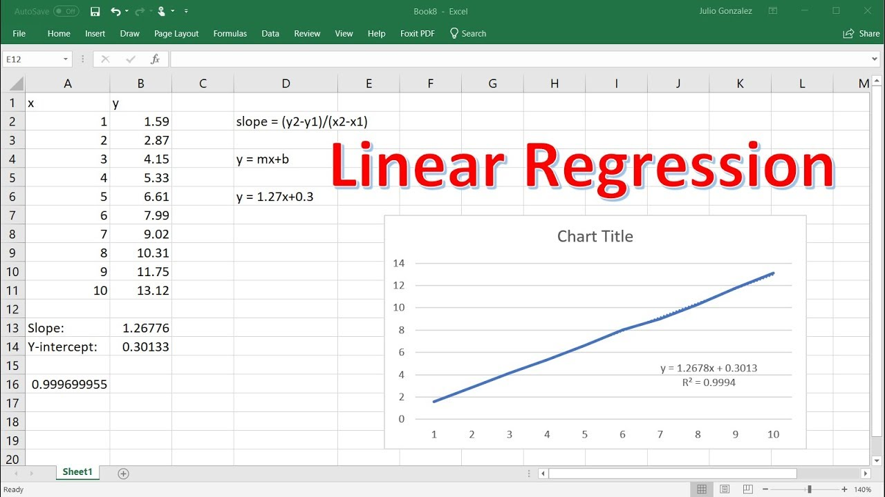
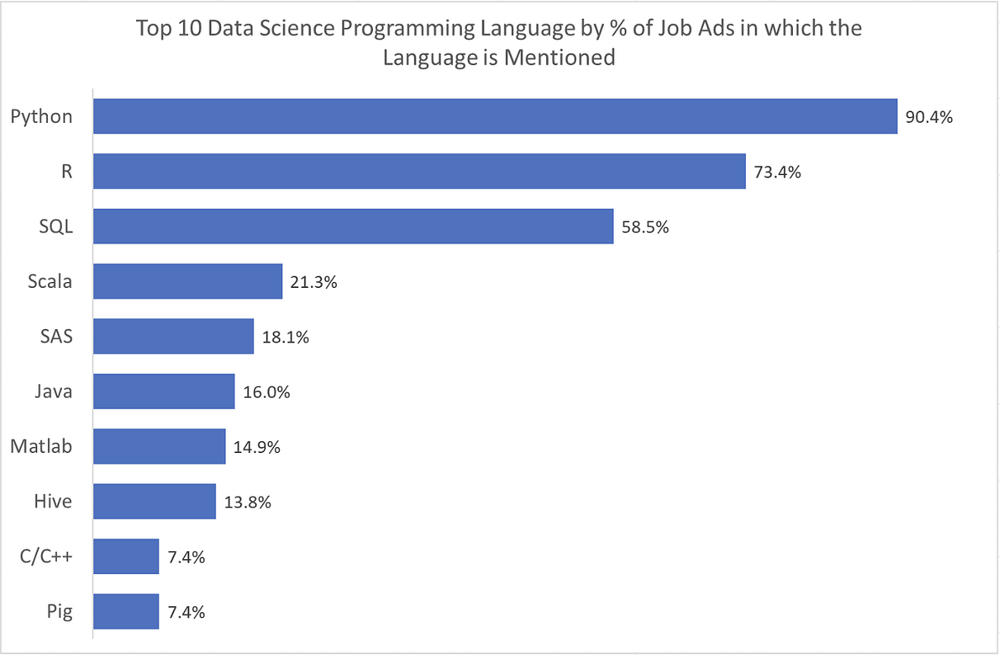
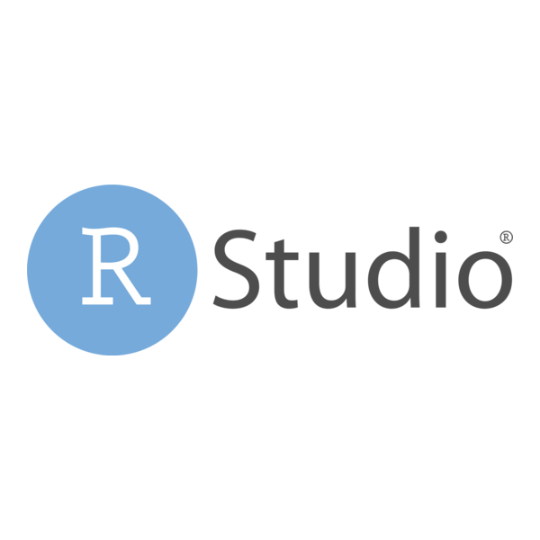

```{r, echo=FALSE, results='hide'}
library("tidyverse");library("qqplotr");theme_set(theme_minimal());library("patchwork")
```



## About Me 

- From Lufkin, Texas (East Tx)
- Undergraduate Education: B.B.A from Baylor University 
  - Majors: Statistics, Business Fellows (Honors), Finance, and Accounting
- Graduate School: PhD in Statistical Science from Baylor University
  
::: {.center}
{width=30%}
:::


## About Me Cont. 

- Khali (Khaleesi)

::: {.columns .absolute top=100px left=250px}

:::{.column width=25%}

:::

:::{.column width=25%}

:::

:::{.column width=25%}

:::

:::

::: {.columns .absolute top=375px left=250px}

:::{.column width=25%}

:::

:::{.column width=25%}

:::

:::{.column width=25%}

:::

:::
## About Me Cont. 

- Girlfriend - Paxton 

:::{.absolute top="100px" left="225px" width="20%"}

:::

:::{.absolute top="101px" left="435px" width="36%"}

:::

:::{.absolute top="350px" left="305px" width="20%"}

:::


:::{.absolute top="350px" left="515px" width="20%"}

:::

## Syllabus

## Software

:::{.incremental}
- We will use the programming language  to perform analysis.
- This is Statistics, why do we need a programming language?? 😐 
  - $\Pr(\text{We flip a coin and get a head}) = 0.50$ requires programming?
:::

:::{.incremental}
- **Statistics** - *the art of collecting, organizing, summarizing,
and describing data as well as drawing inferences from the data.*[- Dr. Amy Maddox]{.subtext}
    - Statistics is math applied to real data [This often referred to as data science]{.subtext}
  - Probability and math work in the background for statistics ...
  - But, modern statistics focuses on the data applications
    - Statistical Modeling & Machine Learning/AI
:::

:::{.incremental}
- This was always the goal of statistics, but computing power limited it
  - These modern methods require computer implementations [i.e. often programming]{.subtext}
:::

## Software Cont.

:::{.center}
{width=50%}
:::

## Why R? 
:::{.incremental}
- Microsoft Excel can perform many of the tasks we do
  [{width=40%}](https://www.youtube.com/watch?v=KwQsV77bYDY){preview-link="true"}
  - However, Excel is primarily a spreadsheet editor and can only perform basic analysis
- Real data is messy and programming gives us flexibility to perform advance analysis
- [Most students will list Excel as skill. A programming language will make you stand out]{style="font-size:.96em;"} ‼️
:::

## Why R? Cont.

- Python and R are the most sought after programming languages for hiring candidates

::: {.center}
[{width=60%}](https://medium.com/data-science/which-programming-language-should-data-scientists-learn-first-aac4d3fd3038){preview-link="true"}
::: 

## Why R? Cont.

:::{.incremental}
- Why not Python if it's more popular? 🧐
  - Python is a "buzzword". Most do not know what the langue actually entails.
  - The language originated in computer science. It excels in software engineering and general scripting.
  [This means it is a lot harder to learn.]{.subsubtext}
  - Python can perform a lot of statistical task (Way more than Excel). But it is not its primary purpose.
    [The statistics options are not native to python.]{.subsubtext}
:::

::: {.incremental}
- R was built by and for statisticians.
  - It's designed specifically for data analysis, modeling, and visualization out of box. [It is much easier to learn. Especially for beginners]{.subsubtext} 
:::

::: {.incremental}
- R has an extensive network of [packages](https://cran.r-project.org/web/views/){preview-link="true"} for seamless and endless applications.
  - Python struggles to match this without heavy setup.
:::

## R Basics
:::{.incremental}
- In its simplest form, R is just a calculator. 
  - For example, to do 1 + 1, we simply type it in like a calculator.

:::{.fragment}
```{webr}

```
:::

- It also supports statistical functions out the box.

:::{.fragment}
```{webr}
data <- c(1, 5, 10, 4, 5, 7)
mean(data)
```
:::
:::


## Understanding R and Rstudio
:::{.incremental}
- [[R](https://cran.r-project.org){preview-link=true}]{.underline}[^1] is a programming language and environment for statistical computing.
  - Again, R is similar to an advanced calculator, but with no interface.
  - You write code and it runs. But there’s no editor or additional tools for help.

:::{.fragment .center}
 $\approx$ English
:::

::: {.fragment .center}
{.content-visible when="format == 'revealjs'"}
:::

:::{.fragment .absolute top=300px left=300px width=500px}

:::
:::

:::{.incremental .absolute top=325px}
- [Rstudio](https://posit.co/download/rstudio-desktop/){preview-link=true} is an editor built for R
  - Makes R more accessible, organized, and efficient. Rstudio provides:
    - An interactive console editor for writing and saving code
    - Panels for plots, packages, and variable environments
:::

:::{.fragment .absolute bottom=15px left=400px}
 $\approx$ 
:::

[^1]: R and Rstudio can be downloaded by clicking the links. More information is given in syllabus.
