```{r, echo=FALSE, results='hide', message=FALSE}
library("tidyverse");library("qqplotr");theme_set(theme_minimal());library("patchwork")
```




# Basics of Data Visualization 

## Why Visualizations Matter
:::{.incremental}
- The first thing we want to do in statistics is visualize our data. Always!
- There are a multitude of measures to describe our data, why do we need graphs ?
  - Data with the same summary statistics can be very different!
:::

:::{.fragment}

:::{.callout-tip title="Dinosaur Dozen"}
Consider the dinosaur dozen dataset, which contains 12 different datasets all with the same summary statistics.
:::

:::{style="font-size:.40em;"}
```{r, eval=FALSE}
#| code-fold: true
#| code-summary: "Show code"
library(datasauRus)
datasaurus_dozen  |>
  group_by(dataset)  |>
  summarize(
    mean_x    = mean(x),
    mean_y    = mean(y),
    std_dev_x = sd(x),
    std_dev_y = sd(y),
    corr_x_y  = cor(x, y)
  )
```
:::

:::{style="font-size:.50em;"}
```{r, echo=FALSE}
library(datasauRus)
  datasaurus_dozen  |>
    filter(dataset != "away") |>
    group_by(dataset)  |>
    summarize(
      mean_x    = mean(x),
      mean_y    = mean(y),
      std_dev_x = sd(x),
      std_dev_y = sd(y),
      corr_x_y  = cor(x, y)
    ) |>
knitr::kable()
```
:::
:::

## Why Visualizations Matter Cont.

:::{.callout-important title="Dinosaur Dozen Cont."}
However, the datasets clearly have different relationships, which become apparent once we graph them!
:::

:::{style="font-size:.65em;"}
```{r, eval=FALSE}
#| code-fold: true
#| code-summary: "Show code"
datasaurus_dozen |>
  filter(dataset != "away") |>
ggplot(aes(x = x, y = y, colour = dataset)) +
    geom_point() +
    theme_void() +
    theme(legend.position = "none",
          strip.background = element_rect(fill = "lightgrey")) +
    facet_wrap(~dataset, ncol = 4)
```
:::

:::{.center}
```{r, echo=FALSE}
datasaurus_dozen |>
  filter(dataset != "away") |>
ggplot(aes(x = x, y = y, colour = dataset)) +
    geom_point() +
    theme_void() +
    theme(legend.position = "none",
          strip.background = element_rect(fill = "lightgrey")) +
    facet_wrap(~dataset, ncol = 4)
```
:::

## Why Visualizations Matter Cont.

- While visualization in very important, it should also rarely be used alone.

:::{.callout-warning style="font-size:1.15em;"}
Images are merely illusions intended to represent the data. However, they aren’t fully the things they represent and can be misinterpreted.
:::

:::{.fragment .absolute top=275 left=250}
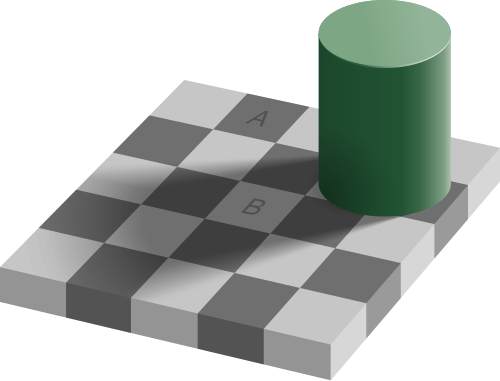{width=75%}
:::

:::{.fragment .absolute top=275 left=250}
{width=75%}
:::


## Why Visualizations Matter Cont.

:::{.center}
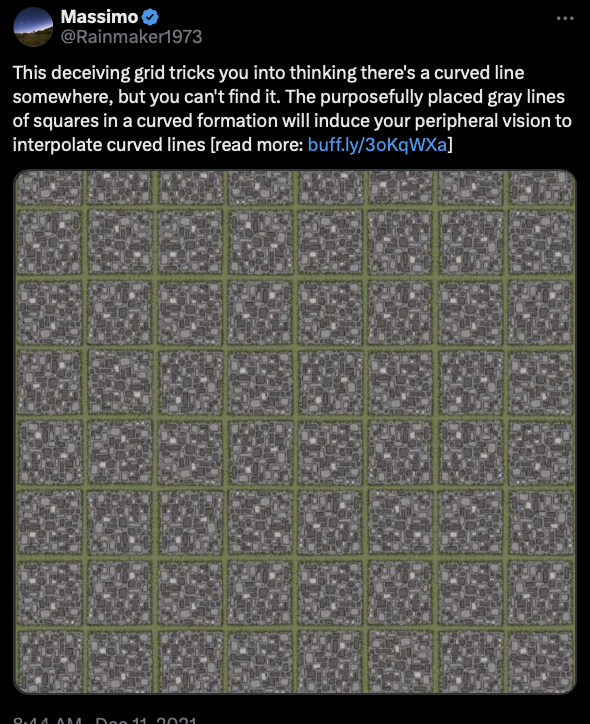{width=25%}
:::

:::{.incremental}
- While we often think of optical illusions as silly images, in statistics it can represent trying to draw incorrect conclusions from graphics
  - This is common with those that have worked hard on research and want to see results
:::


  
## Consideration while Visualizing Data: Overplotting

:::{.incremental}
- Visualizing your data can be fun! [we will learn all type of ways to make graphs and customization options]{.subtext}
- However, over-plotting is very common and can obscure the intention of the graph
- Edward Tufte coined the terms:
  - Data ink: ink used in a visualization necessary to convey meaning
  - Data-ink ratio: ratio of data-ink to non-data ink
:::

## Consideration while Visualizing Data: Overplotting Cont.

:::{.absolute top=30%}
:::{.columns}

:::{.column width=50%}
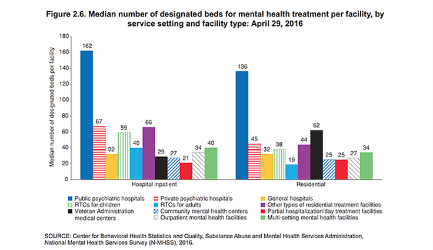
:::

:::{.column width=50%}
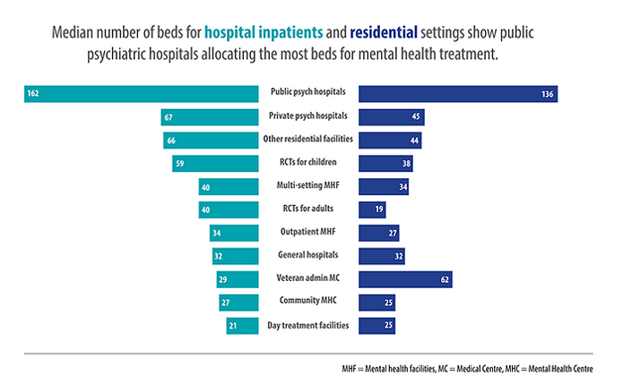
:::

:::
:::

## Consideration while Visualizing Data: Overplotting Cont. 

:::{.callout-tip style="font-size:1.2em;"}
You will know every aspect of your data and want to share it. However, most of the time, only basic visualizations is needed to convey the message [i.e no one likes a confusing graph!]{.subtext}
:::

:::{.center}
![[Source: wikipedia.org/wiki/Chartjunk
]{.subtext}](figures/data_ink3.png){width=45%}
:::

## Consideration while Visualizing Data: Color Usage

:::{.incremental}
- Unless you are color blind, most do not consider how others perceive color in graphs
  - Around 1\% of females are color blind, but around 10\% of males are at least partially color blind [source:https://en.wikipedia.org/wiki/Color_blindness]{.subtext}
:::

:::{.incremental}
- Color consideration goes past color blindess:
  - Using similar colors for different categories can infer they are actually the same
  - Using green and red may infer positive/negative or good/bad 
  - [While becoming less popular, people still print graphics, and often in black and white]{style="font-size:.9em;"} 
:::

:::{.fragment .absolute top=55% left=40% width=25%}
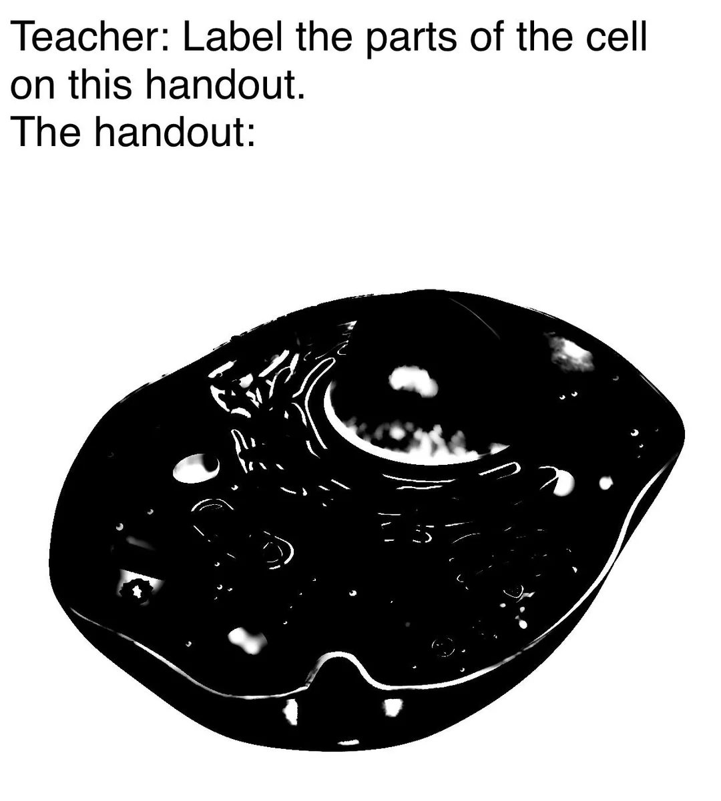
:::

## Consideration while Visualizing Data: Color Usage Cont.
- Rainbow colors are not color blind friendly

:::{style="font-size:.65em;"}
```{r,eval=FALSE}
#| code-fold: true
#| code-summary: "Show code"
p1 <- ggplot(tibble(x = 1:10), aes(x, x)) + 
  geom_point(aes(fill = x), size = 5, shape = 21) +
  theme(text = element_text(size = 12), axis.title = element_blank(), axis.text = element_blank(), axis.ticks = element_blank(), legend.position = c(.2, .8), legend.title = element_blank(), legend.background = element_rect(fill = NA))+
  viridis::scale_fill_viridis(discrete = FALSE)

p2 <- colorblindr::cvd_grid(p1)

p1+p2
```
:::

:::{.center}
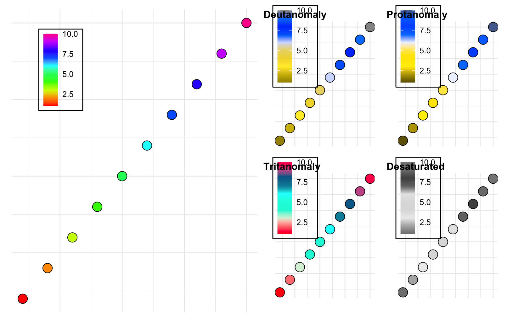{width=70%}
:::

## Consideration while Visualizing Data: Color Usage Cont.

- The [viridis](https://cran.r-project.org/web/packages/viridis/vignettes/intro-to-viridis.html) color scale is often the go to color scale for color consideration

:::{.center}
{width=60%}
:::

:::{style="font-size:.65em;"}
```{r, eval=FALSE}
#| code-fold: true
#| code-summary: "Show code"
p1 <- ggplot(tibble(x = 1:10), aes(x, x)) + 
  geom_point(aes(fill = x), size = 5, shape = 21) +
  theme(text = element_text(size = 12), axis.title = element_blank(), axis.text = element_blank(), axis.ticks = element_blank(), legend.position = c(.2, .8), legend.title = element_blank(), legend.background = element_rect(fill = NA))+
  viridis::scale_fill_viridis(discrete = FALSE)

p2 <- colorblindr::cvd_grid(p1)

p1+p2
```
:::

:::{.center}
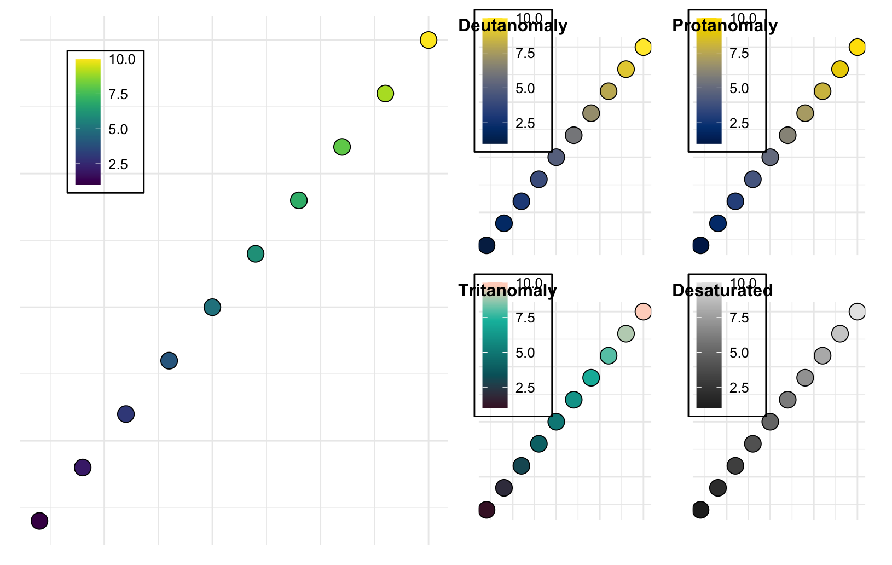{width=65%}
:::

# Plotting in R 

## Plotting in R
:::{.incremental}
- There are two primary ways of making plots in R:
:::

:::{.incremental}
1. Base R `plot()` is the native plotting function in R and does not require packages

2. `ggplot()` is from the `ggplot2` package and allows for layered and customizable plots
:::

:::{.callout-tip .fragment style="font-size:1.2em;"}
To install the `ggplot2` pacakge in R, run this code in R

```{r, eval=FALSE}
install.packages("ggplot2")
```
:::


## Plotting in R: plot() Cont. 

- `plot()` has two main arguments `x,y`: the x and y arguments provide the x and y coordinates for the plot.

:::{style="opacity: 0.5; font-size:.8em;"}
```{r, eval=FALSE}
set.seed(1)
x_cords <- rnorm(50) # 50 random numbers
y_cords <- 5*x_cords + rnorm(50) # y = 5*X + error
```
:::

```{webr}
#| include: false
set.seed(1)
x_cords <- rnorm(50) # 50 random numbers
y_cords <- 5*x_cords + rnorm(50) # y = 5*X + error
```


```{webr}
#| fig-height: 4
plot(x = x_cords, y = y_cords)
```


## Plotting in R: plot() Cont. 

- `plot()` has two main arguments `x,y`: the x and y arguments provide the x and y coordinates for the plot.

```{r, eval=FALSE}
#| code-line-numbers: "4"
set.seed(1)
x_cords <- rnorm(50)
y_cords <- 5*x_cords + rnorm(50)
plot(x_cords, y_cords)
```

:::{.center}
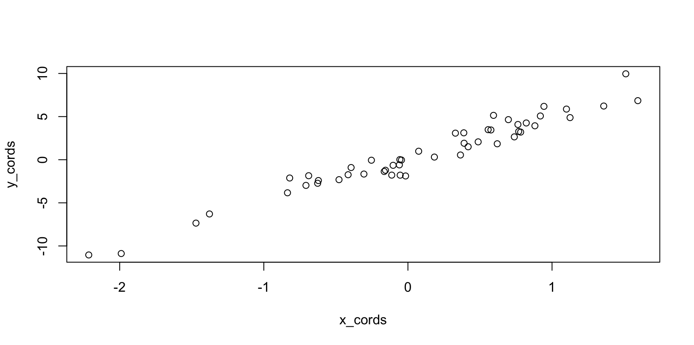{width=65%}
:::

## Plotting in R: plot() Cont.

- `plot()` has two main arguments `x,y`: the x and y arguments provide the x and y coordinates for the plot.
- We can change: colors using `col` argument

```{r, eval=FALSE}
#| code-line-numbers: "4"
set.seed(1)
x_cords <- rnorm(50)
y_cords <- 5*x_cords + rnorm(50)
plot(x_cords, y_cords, col = "blue")
```


:::{.center}
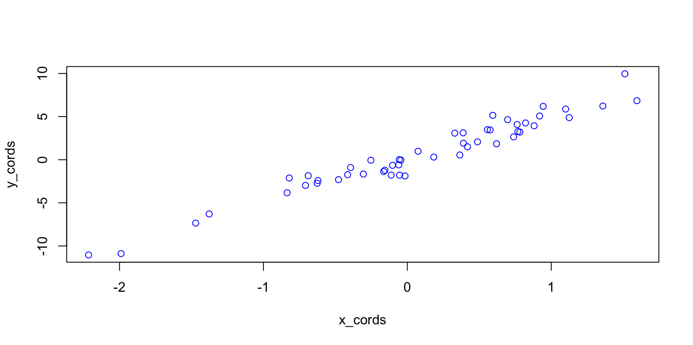{width=65%}
:::

## Plotting in R: plot() Cont.

- `plot()` has two main arguments `x,y`: the x and y arguments provide the x and y coordinates for the plot.
- We can change: shapes using `pch` argument

```{r, eval=FALSE}
#| code-line-numbers: "4"
set.seed(1)
x_cords <- rnorm(50)
y_cords <- 5*x_cords + rnorm(50)
plot(x_cords, y_cords, col = "blue", pch = 19) # solid circles
```


:::{.center}
{width=65%}
:::


## Plotting in R: plot() Cont. 

- `plot()` has two main arguments `x,y`: the x and y arguments provide the x and y coordinates for the plot.
- We can change: shapes using `pch` argument

```{r, eval=FALSE}
#| code-line-numbers: "4"
set.seed(1)
x_cords <- rnorm(50)
y_cords <- 5*x_cords + rnorm(50)
plot(x_cords, y_cords, col = "blue", pch = 17) # solid triangles
```


:::{.center}
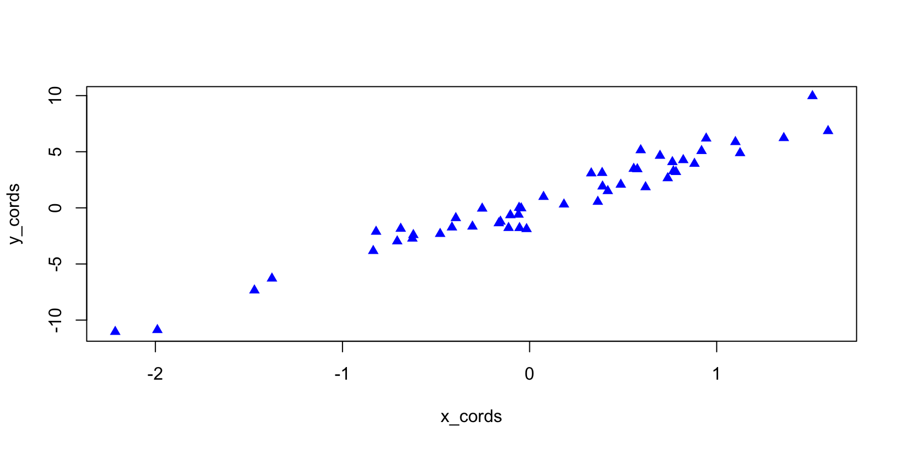{width=65%}
:::

## Plotting in R: plot() Cont.

- `plot()` has two main arguments `x,y`: the x and y arguments provide the x and y coordinates for the plot.
- We can connect the points using: `lines()`

```{r, eval=FALSE}
#| code-line-numbers: "5"
set.seed(1)
x_cords <- rnorm(50)
y_cords <- 5*x_cords + rnorm(50)
plot(x_cords, y_cords, col = "blue", pch = 17) # solid triangles
lines(x_cords, y_cords)
```


:::{.center}
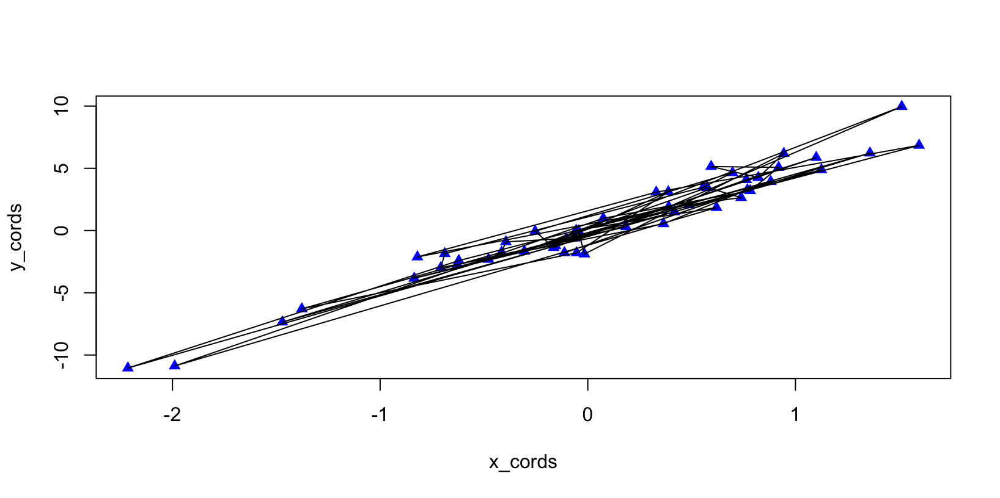{width=65%}
:::

## Plotting in R: plot() Cont.

- `plot()` has two main arguments `x,y`: the x and y arguments provide the x and y coordinates for the plot.
- We can add a line using: `ablines(lm(y~x))`

```{r, eval=FALSE}
#| code-line-numbers: "5"
set.seed(1)
x_cords <- rnorm(50)
y_cords <- 5*x_cords + rnorm(50)
plot(x_cords, y_cords, col = "blue", pch = 17) # solid triangles
abline(lm(y_cords~x_cords))
```


:::{.center}
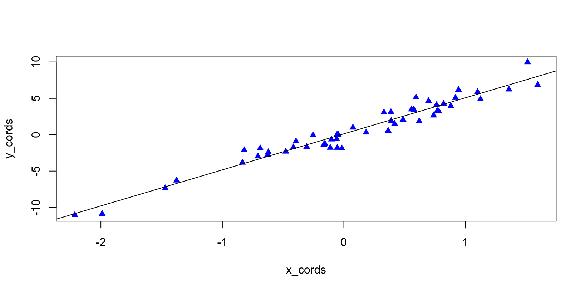{width=65%}
:::

## ggplot: Grammer of Graphics

[In brief, the grammar \[of graphics\] tells us that a statistical graphic is a mapping from data to aesthetic attributes (colour, shape, size) of geometric objects (points, lines, bars). - Hadley Wickham]{style="color:grey;"}

:::{.incremental}
- **Aesthetic**: visual property of an object [Think: color, size, transparency, etc.]{.subtext}
- **Aesthetic mapping**: a relation between variables and visual elements $aes:variables \longrightarrow aesthetics$
:::

:::{.fragment .absolute top=335 left=272 width=55%}
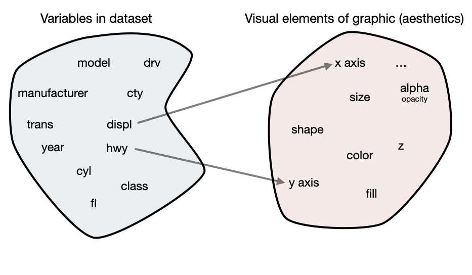
:::

:::{.fragment .absolute top=335 left=272 width=55%}
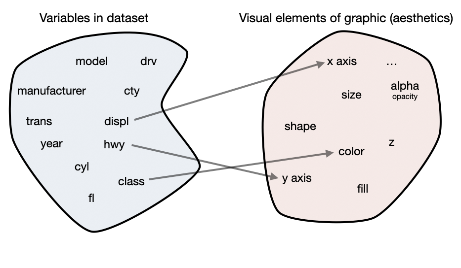
:::

:::{.fragment .absolute top=335 left=272 width=55%}
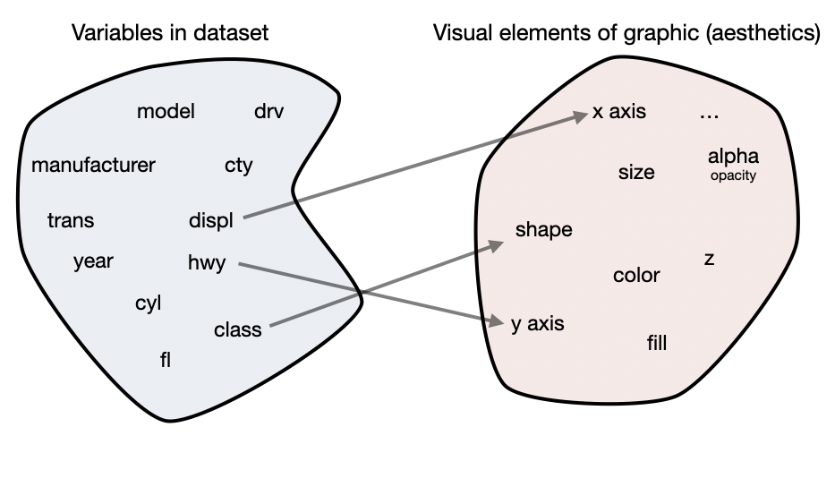
:::


## Plotting in R: ggplot()

:::{.incremental}
- `ggplot()` has 2 main arguments `data, mapping`
  - `data`:	Default dataset to use for plot.
- First we create a `data.frame` from our variables
```{r, echo=FALSE}
set.seed(1)
x_cords <- rnorm(50)
y_cords <- 5*x_cords + rnorm(50)
```

:::{.fragment}
```{r}
mydata <- data.frame(x_cords, y_cords)
```
:::

- Now we give our data frame as an argument and get ... 

:::{.fragment}
```{webr}
#| include: false

set.seed(1)
x_cords <- rnorm(50)
y_cords <- 5*x_cords + rnorm(50)

mydata <- data.frame(x_cords, y_cords)
```

```{webr}
library(ggplot2)
ggplot(data = mydata)
```

:::{.center}
A blank plot??
:::

:::

:::


## Plotting in R: ggplot() Cont.
- `ggplot` is based off the grammar of graphics which expects a mapping using `aes()` to connect variables to aesthetics like x and y.

:::{.fragment}
```{webr}
ggplot(data = mydata, mapping = aes(x_cords, y_cords))
```

<!-- :::{.center} -->
<!-- 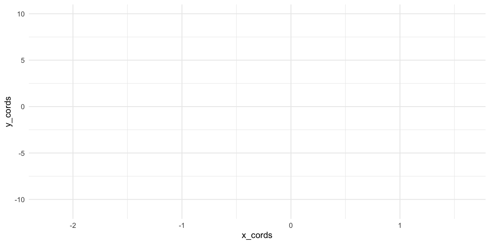{width=70%} -->
<!-- ::: -->
:::

:::{.fragment}
- This give a plot with x and y axis, but no points?
:::


## Plotting in R: ggplot() Cont.
:::{.incremental}
- `ggplot` works by adding layers using `geom_` functions.
  - For example, to add points we use ` + geom_point()`

:::{.fragment}  
```{webr}
ggplot(data = mydata, mapping = aes(x_cords, y_cords))+
  geom_point()
```
:::

<!-- :::{.center} -->
<!-- 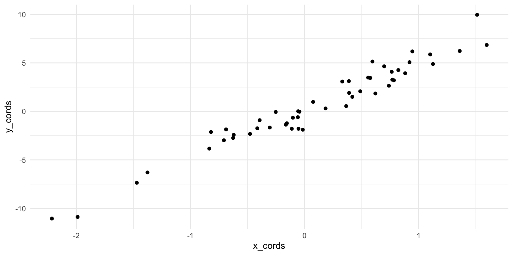{width=75%} -->
<!-- ::: -->

:::

## Plotting in R: ggplot() Cont.
- adding `geom_` functions to our plots allows us to easily add other layers and our intention is clear

```{r, eval=FALSE}
#| code-line-numbers: "3"
ggplot(data = mydata, mapping = aes(x_cords, y_cords))+
  geom_point()+
  geom_line()
```

:::{.center}
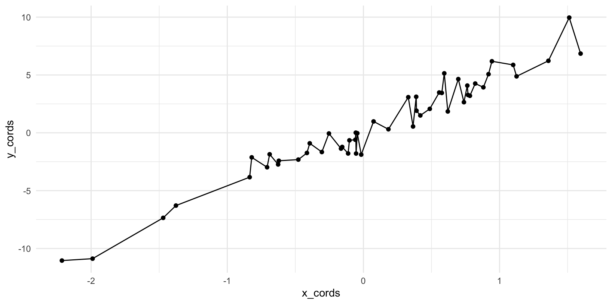{width=75%}
:::

## Plotting in R: ggplot() Cont.
- adding `geom_` functions to our plots allows us to easily add other layers and our intention is clear 

```{r, eval=FALSE}
#| code-line-numbers: "4"
ggplot(data = mydata, mapping = aes(x_cords, y_cords))+
  geom_point()+
  geom_line()+
  geom_smooth()
```

:::{.center}
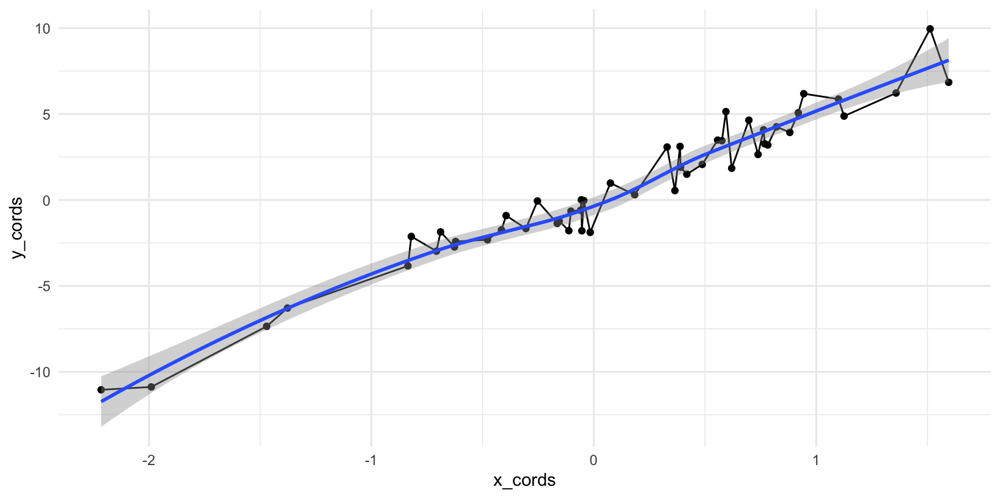{width=75%}
:::

## Plotting in R: ggplot() Cont.
- Typically the ggplot syntax is cleaner and you do not need to reference each argument

:::{.fragment}
```{r, eval=FALSE}
ggplot(aes(x_cords, y_cords), data = mydata)+ # using a data frame
  geom_point()
```

:::{.center}
{width=75%}
:::

:::

## Plotting in R: ggplot() Cont.
- Typically the ggplot syntax is cleaner and you do not need to reference each argument
```{r, eval=FALSE}
#| code-line-numbers: "1"
ggplot(aes(x_cords, y_cords), data = NULL)+ # not using a data frame
  geom_point()
```

:::{.center}
{width=75%}
:::

## Plotting in R: ggplot() Cont.
- We can change: colors using `color` argument in the particular layer
```{r, eval=FALSE}
#| code-line-numbers: "2"
ggplot(aes(x_cords, y_cords), data = mydata)+
  geom_point(color = "blue")
```

:::{.center}
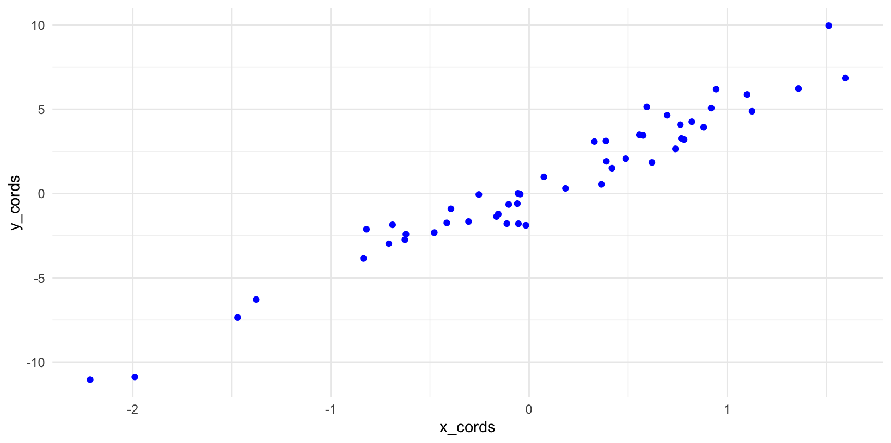{width=75%}
:::

## Plotting in R: ggplot() Cont.
- We can change: shape using `shape` argument in the particular layer
```{r, eval=FALSE}
#| code-line-numbers: "2"
ggplot(aes(x_cords, y_cords), data = mydata) +
  geom_point(color = "blue", shape = 17) # triangle shape
```

:::{.center}
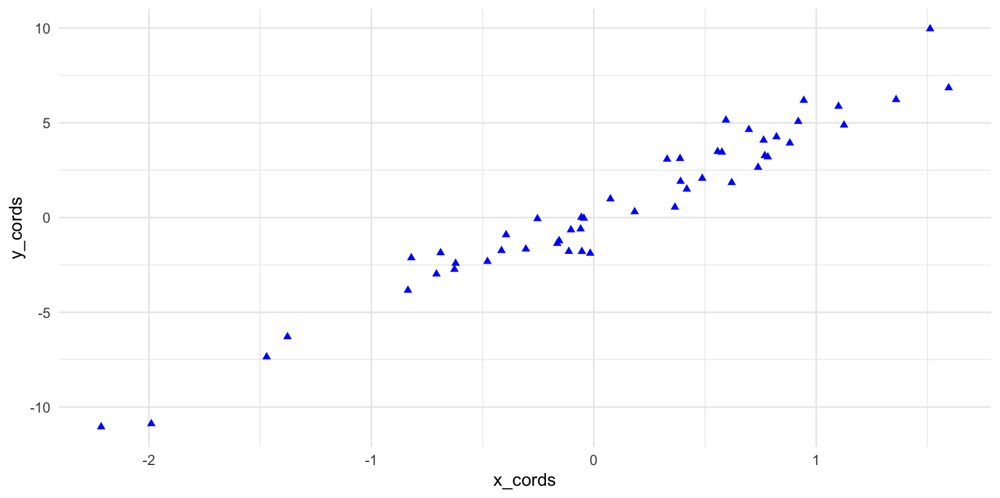{width=75%}
:::

## Plotting in R: ggplot() Cont.
- We can change: layers and add layers with additional changes
```{r, eval=FALSE}
#| code-line-numbers: "3"
ggplot(aes(x_cords, y_cords), data = mydata) +
  geom_point(color = "blue", shape = 17) +
  geom_smooth(color = "red", linetype = "dashed", se = FALSE)
```

:::{.center}
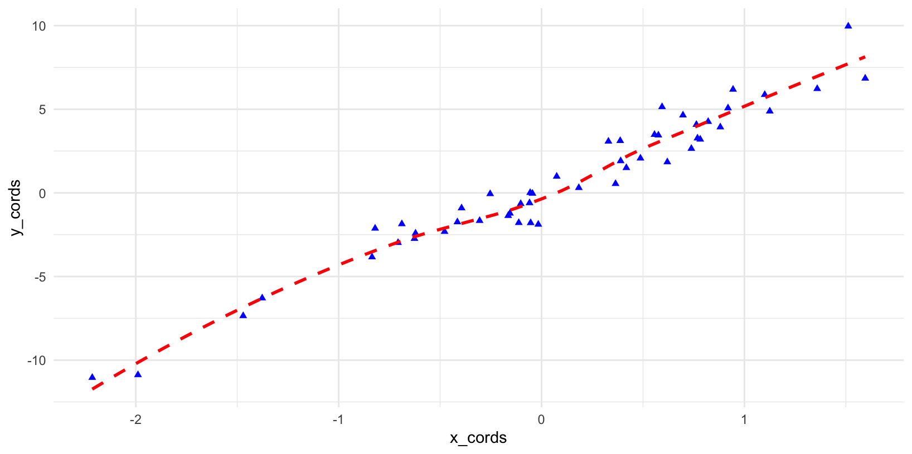{width=75%}
:::

## Plotting in R: ggplot() Cont.
- We can change: layer order. Now the points are on top of the line.
```{r, eval=FALSE}
#| code-line-numbers: "2-3"
ggplot(aes(x_cords, y_cords), data = mydata) +
  geom_smooth(color = "red", linetype = "solid", se = FALSE)+
  geom_point(color = "blue", shape = 17)
```

:::{.center}
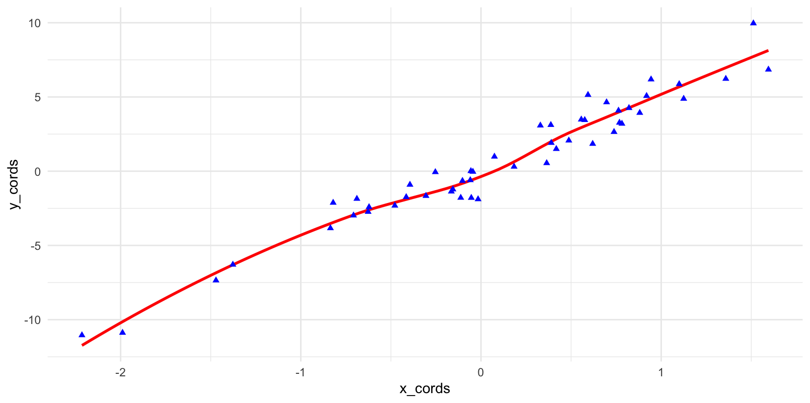{width=75%}
:::

## Plotting in R: ggplot() Cont.
- ggplot also allows for themes

:::{.center}
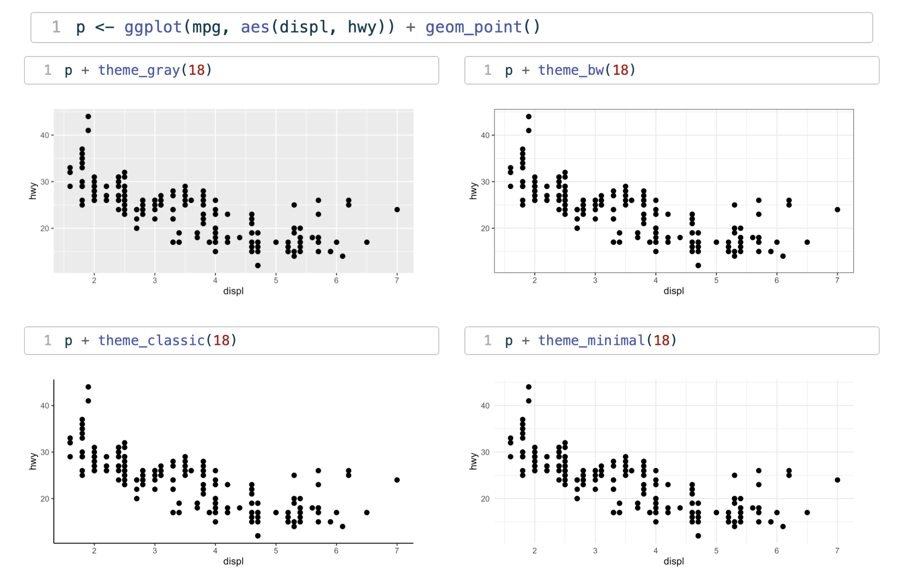{width=80%}
:::

## Plotting in R: ggplot() Cont.

:::{.center}
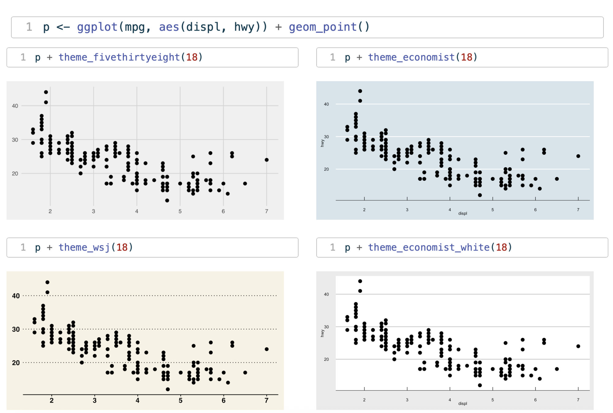{width=85%}
:::

## Plotting in R: plot() vs ggplot()
:::{.incremental}
- While initially ggplot may seem more complicated it allows for:
  - layering, faceting, and consistent aesthetics with minimal code
  - quickly becomes more efficient than repeatedly customizing `plot()`  
:::


:::{.fragment}
::: panel-tabset

### ggplot

:::{style="font-size:.6em;"}
```{r, eval=FALSE}
#| code-fold: true
#| code-summary: "Show code"
ggplot(iris, aes(Sepal.Length, Sepal.Width, color = Species)) +
  geom_point() +
  geom_smooth(se = FALSE, method = "lm") +
  facet_wrap(~Species, scales = "free")
```
:::

:::{.center}
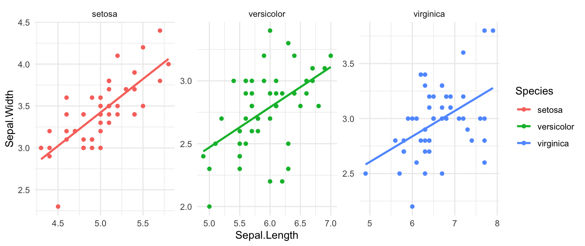{width=70%}
:::

### plot

:::{style="font-size:.6em;"}
```{r,eval=FALSE}
#| code-fold: true
#| code-summary: "Show code"
cols <- c("#F8766D", "#7CAE00", "#00BFC4")
par(mfrow = c(1, 3))
for (i in seq_along(levels(iris$Species))) {
  sp <- levels(iris$Species)[i]
  subdat <- subset(iris, Species == sp)
  plot(
    subdat$Sepal.Length,
    subdat$Sepal.Width,
    main = sp,
    col = cols[i],
    pch = 19
  )
  fit <- lm(Sepal.Width ~ Sepal.Length, data = subdat)
  lines(subdat$Sepal.Length,
        predict(fit),
        col = cols[i],
        lwd = 2)
}
```
:::

:::{.center}
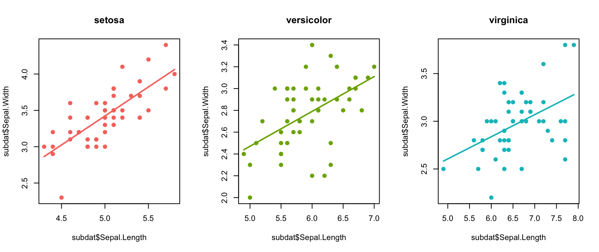{width=70%}
:::
:::
:::

## An Aside on Plotting in R

:::{.absolute top=25%}

:::{.callout-tip style="font-size:1.5em;"}
It is not expected you memorize coding for all possible plots. This is where you responsibly use AI or Google (even I do this a lot!). But you should understand the basics of plotting such as aesthetics and ect.
:::

:::

# Graphics Cookbook

## Graphics Cookbook Intro
- Each data type (discrete or continuous) and the number of variables (1, 2, 3, or more) will determine the basic plots needed to described your data
  - This section will go over many of the essential plots and how to construct them in R

:::{.center}
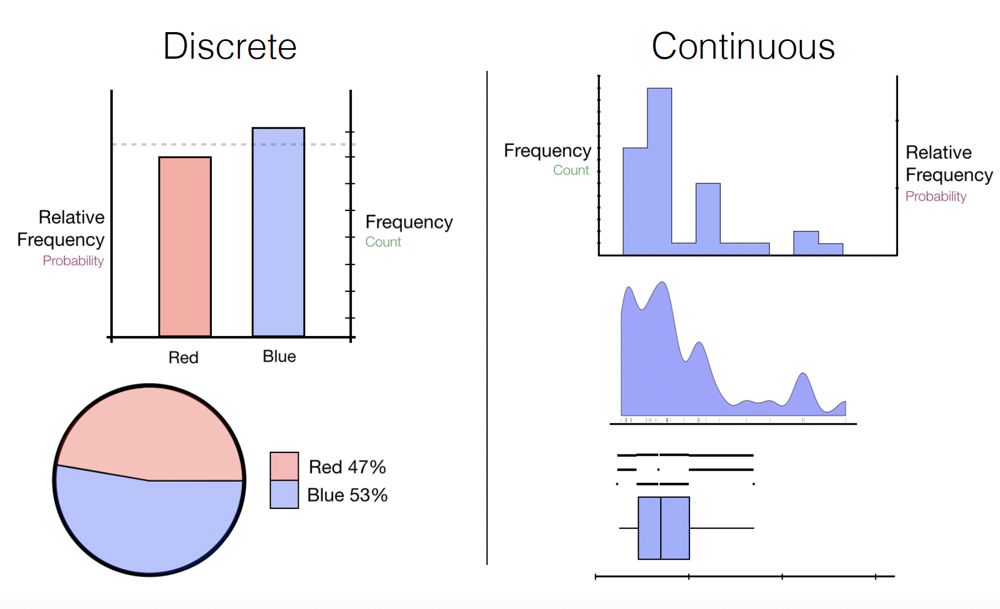{width=50%}
:::

## 1 Discrete Variable: Bar Chart

- *Bar Chart*: If we have only one discrete variable *X*, we use a bar chart to plot the frequency/count of each category/discrete option.

::: columns
::: {.column width="35%"}
Data

```{r, echo=FALSE}
tibble("Observation" = paste0("Observ ", 1:6), 
       "X" = c(2, 4, 2, 1, 2, 4)) |> 
  knitr::kable()
```

:::

::: {.column width="3%"}
:::

::: {.column width="62%"}
Bar Chart

::: panel-tabset

### Base R
```{r}
X <- c(2, 4, 2, 1, 2, 4)
barplot(table(X))
```

### ggplot
```{r}
X <- c(2, 4, 2, 1, 2, 4)
ggplot(aes(X), data = NULL)+
  geom_bar()
```

:::
:::
:::

## 1 Discrete Variable: Bar Chart Cont. 
- Similarly, we can plot a bar chart using the proportion of each value instead of frequency

::: columns
::: {.column width="35%"}
Data

```{r, echo=FALSE}
tibble("Observation" = paste0("Observ ", 1:6), 
       "X" = c(2, 4, 2, 1, 2, 4)) |> 
  knitr::kable()
```

:::

::: {.column width="3%"}
:::

::: {.column width="62%"}
Bar Chart

::: panel-tabset

### Base R
```{r}
X <- c(2, 4, 2, 1, 2, 4)
barplot(prop.table(table(X)), ylab = "Proportion")
```

### ggplot
```{r}
X <- c(2, 4, 2, 1, 2, 4)
ggplot(aes(X, after_stat(count / sum(count))), data = NULL)+
  geom_bar()+
  labs(y = "Proportion")
```


:::
:::
:::

## 1 Discrete Variable: Scatterplot  and Overfitting

- We can also visualize a 1D discrete variable using a scatter plot by fixing the y-value [in this case, we fix y = 0 for all observations]{.subtext}

::: panel-tabset

### ggplot
```{r, fig.width=8, fig.height=3.5}
ggplot(aes(cut, y = 0), data = diamonds) +
  geom_point()
```

### base R

```{r, fig.width=8, fig.height=3.5}
plot(diamonds$cut, rep(0, length(diamonds$cut)))
```

### Data

```{r, echo=TRUE, eval=FALSE}
diamonds
```
```{r, echo=FALSE}
diamonds |> 
  select(-c(x, y, z)) |> 
  head() |> 
  knitr::kable()
```

:::

:::{.fragment}
- However, since there is no y-value, this suffers from **overplotting**: Visual confusion in graphic
caused by plotting too much data 
:::


## 1 Discrete Variable: Scatterplot  and Overfitting Cont.

- One way to fix over plotting is to "jitter" the data. This refers to adding random noise to each observations to separate them for better visualization. 

:::{.fragment}

::: panel-tabset

### ggplot
```{r, fig.width=8, fig.height=3.5}
#| code-line-numbers: "2"
ggplot(aes(cut, y = 0), data = diamonds) +
  geom_point()
```

### base R

```{r, fig.width=8, fig.height=3.5}
plot(diamonds$cut, rep(0, length(diamonds$cut)))
```

:::

:::

## 1 Discrete Variable: Scatterplot  and Overfitting Cont. 

- One way to fix over plotting is to "jitter" the data. This refers to adding random noise to each observations to separate them for better visualization. 


::: panel-tabset

### ggplot
```{r, fig.width=8, fig.height=3.5}
#| code-line-numbers: "2"
ggplot(aes(cut, y = 0), data = diamonds) +
  geom_jitter()
```

### base R

```{r, fig.width=8, fig.height=3.5}
x <- as.numeric(diamonds$cut)
y <- rep(0, length(diamonds$cut))
plot(jitter(x), jitter(y), xaxt = "n", xlab = "cut")
axis(1, at = 1:length(levels(diamonds$cut)), labels = levels(diamonds$cut))
```

:::

## 1 Discrete Variable: Scatterplot  and Overfitting Cont. 

- One way to fix over plotting is to "jitter" the data. This refers to adding random noise to each observations to separate them for better visualization. 


::: panel-tabset

### ggplot
```{r, fig.width=8, fig.height=3.5}
#| code-line-numbers: "2"
ggplot(aes(cut, y = 0), data = diamonds) +
  geom_jitter(alpha=.5) # add alpha blending
```

### base R

```{r, fig.width=8, fig.height=3.5}
#| code-line-numbers: "4-5"
x <- as.numeric(diamonds$cut)
y <- rep(0, length(diamonds$cut))
plot(jitter(x), jitter(y), xaxt = "n", xlab = "cut", 
     col = adjustcolor("black", alpha.f = 0.2),
     pch = 19)
axis(1, at = 1:length(levels(diamonds$cut)), labels = levels(diamonds$cut))
```

:::

:::{.absolute top=350 right=0 width=28% syle="font-size:.5em;"}
We can further reduce over plotting by using **alpha blending**: reducing the opacity of points to avoid cluttering
:::

## 1 Discrete Variable: Scatterplot  and Overfitting Cont. 

- One way to fix over plotting is to "jitter" the data. This refers to adding random noise to each observations to separate them for better visualization. 


::: panel-tabset

### ggplot
```{r, fig.width=8, fig.height=3.5}
#| code-line-numbers: "2"
ggplot(aes(cut, y = 0), data = diamonds) +
  geom_jitter(alpha=.1) # add alpha blending
```

### base R

```{r, fig.width=8, fig.height=3.5}
#| code-line-numbers: "4-5"
x <- as.numeric(diamonds$cut)
y <- rep(0, length(diamonds$cut))
plot(jitter(x), jitter(y), xaxt = "n", xlab = "cut", 
     col = adjustcolor("black", alpha.f = 0.1),
     pch = 19)
axis(1, at = 1:length(levels(diamonds$cut)), labels = levels(diamonds$cut))
```

:::

:::{.absolute top=350 right=0 width=28% syle="font-size:.5em;"}
We can further reduce over plotting by using **alpha blending**: reducing the opacity of points to avoid cluttering
:::

## 1 Continuous Variable: Histogram and Distribution

- **Histogram**: If we have one variable *X* which is continuous, then we use a *histogram* to plot the distribution of *X* [like a barchart, but now each bar represents a range of values]{.subtext}

Ex: Suppose *X* has values from 1.5 to 4, and we want a histogram with 5 bars.

::: columns
::: {.column width="35%"}
Data

```{r, eval=FALSE}
#| code-fold: true
#| code-summary: "Show code"

set.seed(1)
X <- c(runif(1, 1.5, 2), 
       runif(2, 2, 2.5), 
       runif(3, 2.5, 3), 
       runif(1, 3, 3.5), 
       runif(2, 3.5, 4))
```


```{r, echo=FALSE}
set.seed(1)
X <- c(runif(1, 1.5, 2), 
       runif(2, 2, 2.5), 
       runif(3, 2.5, 3), 
       runif(1, 3, 3.5), 
       runif(2, 3.5, 4))
tibble("Observation" = paste0("Observ ", 1:9), 
       "X" = X) |> 
  knitr::kable()
```

:::

::: {.column width="3%"}
:::

::: {.column width="62%"}
Histogram

::: panel-tabset

### Base R
```{r}
hist(X, breaks = 5)
```

### ggplot
```{r}
ggplot(aes(X), data = NULL)+
  geom_histogram(bins = 5)
```

:::
:::
:::

## 1 Continuous Variable: Histogram and Distribution Cont. 

Suppose we now have 100 observations, should we still use 5 bars? 

```{r}
#| code-line-numbers: "5"
set.seed(1)
X <- rnorm(100)
ggplot(aes(X), data = NULL)+
  geom_histogram(
    bins = 5, 
    color = "black", fill = "lightgrey")
```

## 1 Continuous Variable: Histogram and Distribution Cont. 

Suppose we now have 100 observations, should we still use 5 bars? 
[*Solution*]{.underline}: No! It over simplifies the structure of the data. For histograms, the number of bars should be reasonable compared to the number of observations. 

```{r}
#| code-line-numbers: "5"
set.seed(1)
X <- rnorm(100)
ggplot(aes(X), data = NULL)+
  geom_histogram(
    bins = 25, 
    color = "black", fill = "lightgrey")
```

## 1 Continuous Variable: Histogram and Distribution Cont. 

Suppose we now have 100 observations, should we still use 5 bars? 
[*Solution*]{.underline}: No! It over simplifies the structure of the data. For histograms, the number of bars should be reasonable compared to the number of observations. 

```{r}
#| code-line-numbers: "5"
set.seed(1)
X <- rnorm(100)
ggplot(aes(X), data = NULL)+
  geom_histogram(
    bins = 25, 
    color = "black", fill = "lightgrey")
```

## 1 Continuous Variable: Histogram and Distribution Cont. 

Suppose we now have 100 observations, should we still use 5 bars? 
[*Solution*]{.underline}: No! It over simplifies the structure of the data. For histograms, the number of bars should be reasonable compared to the number of observations. 

```{r}
#| code-line-numbers: "5"
set.seed(1)
X <- rnorm(100)
ggplot(aes(X), data = NULL)+
  geom_histogram(
    bins = 75, 
    color = "black", fill = "lightgrey")
```

## 1 Continuous Variable: Histogram and Distribution Cont.
- **Kernel Density Estimate**: A smoothed out estimate of the shape of a histogram

::: panel-tabset

### Base R
```{r, fig.height=4, fig.width=8}
#| code-line-numbers: "3"
set.seed(1)
X <- rnorm(100)
plot(density(X))
```

### ggplot
```{r, fig.height=3.5, fig.width=8}
#| code-line-numbers: "3-4"
set.seed(1)
X <- rnorm(100)
ggplot(aes(X), data = NULL)+
  geom_density()
```

:::

## 1 Continuous Variable: Histogram and Distribution Cont. 
- We can also do a histogram with density overlay for more information

::: panel-tabset

### Base R
```{r, fig.height=4, fig.width=8}
#| code-line-numbers: "3-4"
set.seed(1)
X <- rnorm(100)
hist(X, breaks = 30, freq = FALSE)
lines(density(X), col = "blue")
```

### ggplot
```{r, fig.height=3.5, fig.width=8}
#| code-line-numbers: "3-5"
set.seed(1)
X <- rnorm(100)
ggplot(aes(X, after_stat(..density..)), data = NULL)+
  geom_histogram(color = "black", fill = "lightgrey")+
  geom_density(color = "blue")
```

:::

## 1 Continuous Variable: Distribution Shapes

- Generally, most data might follow one of three shapes: Symmetric, Right Skewed, Left Skewed [skewness refers to the data being skewed in one direction due to outliers]{.subtext}

```{r, echo = FALSE}
#| code-fold: true
#| code-summary: "Show code"
set.seed(1)
tibble("Symmetric" = rnorm(1000), 
       "Right Skewed" = rexp(1000, rate = 1), 
       "Left Skewed" = -rexp(1000, rate = 1)) |> 
  pivot_longer(everything(), names_to = "shape") |> 
  mutate("shape" = as_factor(shape)) |> 
  ggplot(aes(value, color = shape))+
  geom_density()+
  facet_wrap(~shape, scales ="free")+
  theme(strip.background = element_rect(fill = "lightgrey"), 
        axis.text.y = element_blank(), 
        axis.text.x = element_blank(), 
        axis.title.x = element_blank(), 
        legend.position = "none")+
  ggh4x::facetted_pos_scales(x = list(
    shape ==  "Symmetric" ~ scale_x_continuous(limits = c(-3, 3)),
    shape ==  "Right Skewed" ~ scale_x_continuous(limits = c(-.5, 6)),
    shape ==  "Left Skewed" ~ scale_x_continuous(limits = c(-6, .6))
  ))
```

:::{.fragment .absolute top=650 left=125}
Mean $\approx$ Median
:::

:::{.fragment .absolute top=650 left=425}
Mean $>$ Median
:::

:::{.fragment .absolute top=650 right=100}
Mean $<$ Median
:::

## 1 Continuous Variable: Boxplot

- **Boxplot**: distribution plot of the data using quartiles 
  - Generally, any point plotted outside boxplot and lines is an outlier

::: panel-tabset

### Base R
```{r, fig.height=4}
#| code-line-numbers: "3-4"
set.seed(1)
X <- c(rnorm(100), -5, 4, 6)
boxplot(X)
```

### ggplot
```{r, fig.height=4}
#| code-line-numbers: "3-4"
set.seed(1)
X <- c(rnorm(100), -5, 4, 6)
ggplot(aes(X), data = NULL)+
  geom_boxplot()
```

:::

## 1 Discrete/Continuous Variable and 1 Qualitative Variable 

- **Faceting** - If we have one variable that is associated with a qualitative variable, we can plot any of the previous plots broken up by each quality/category[this is referred to as faceting]{.subtext}


::: columns
::: {.column width="35%"}
Data

```{r, echo=FALSE}
set.seed(1)
my_data <- data.frame("X" =  c(rpois(10, 5), rpois(10, 2)), 
                      "Group" = rep(c("A", "B"), each = 10))
my_data |> 
  slice_sample(n = 5, by = Group) |> 
  knitr::kable(align = "lrr")
```

:::

::: {.column width="3%"}
:::

::: {.column width="62%"}
Bar Chart Faceted

::: panel-tabset

### ggplot
```{r, echo=FALSE}
theme_set(theme_grey())
```

```{r}
#| code-line-numbers: "4-6"
set.seed(1)
my_data <- data.frame("X" =  c(rpois(10, 5), rpois(10, 2)), 
                      "Group" = rep(c("A", "B"), each = 10))
ggplot(aes(X), data = my_data)+
  geom_bar()+
  facet_wrap(~Group)
```

### Base R
```{r}
par(mfrow = c(1, 2))  # one row, two panels
for(i in unique(my_data$Group)) {
  barplot(table(my_data$X[my_data$Group == i]),
       main = paste("Group", i),
       xlab = "X")
}
```

:::
:::
:::

## 1 Discrete/Continuous Variable and 1 Qualitative Variable Cont. 

- **Faceting** - If we have one variable that is associated with a qualitative variable, we can plot any of the previous plots broken up by each quality/category[this is referred to as faceting]{.subtext}

 
**Histogram Faceted**

::: panel-tabset

### ggplot

```{r, fig.height=3, fig.width=8}
#| code-line-numbers: "4-6"
set.seed(1)
my_data <- data.frame("X" =  c(rnorm(100, 5), rnorm(100, 2)), 
                      "Group" = rep(c("A", "B"), each = 100))
ggplot(aes(X), data = my_data)+
  geom_histogram(fill = "lightgrey", color = "black")+
  facet_wrap(~Group)
```

### Base R
```{r, fig.height=3, fig.width=8}
par(mfrow = c(1, 2))  # one row, two panels
for(i in unique(my_data$Group)) {
  hist(my_data$X[my_data$Group == i],
       main = paste("Group", i),
       xlab = "X", 
       breaks = 30)
}
```

:::


## 1 Discrete/Continuous Variable and 1 Qualitative Variable Cont. 

- **Faceting** - If we have one variable that is associated with a qualitative variable, we can plot any of the previous plots broken up by each quality/category[this is referred to as faceting]{.subtext}

**Density Faceted**

::: panel-tabset

### ggplot

```{r, fig.height=3, fig.width=8}
#| code-line-numbers: "5"
set.seed(1)
my_data <- data.frame("X" =  c(rnorm(100, 5), rnorm(100, 2)), 
                      "Group" = rep(c("A", "B"), each = 100))
ggplot(aes(X), data = my_data)+
  geom_density()+
  facet_wrap(~Group)
```

### Base R
```{r, fig.height=3, fig.width=8}
#| code-line-numbers: "3"
par(mfrow = c(1, 2))  # one row, two panels
for(i in unique(my_data$Group)) {
  plot(density(my_data$X[my_data$Group == i]),
       main = paste("Group", i),
       xlab = "X")
}
```

:::

## 1 Discrete/Continuous Variable and 1 Qualitative Variable Cont. 

- **Faceting** - If we have one variable that is associated with a qualitative variable, we can plot any of the previous plots broken up by each quality/category[this is referred to as faceting]{.subtext}

**Boxplot Faceted**

::: panel-tabset

### ggplot

```{r, fig.height=3, fig.width=8}
#| code-line-numbers: "5"
set.seed(1)
my_data <- data.frame("X" =  c(rnorm(100, 5), rnorm(100, 2)), 
                      "Group" = rep(c("A", "B"), each = 100))
ggplot(aes(X), data = my_data)+
  geom_boxplot()+
  facet_wrap(~Group)
```

### Base R
```{r, fig.height=3, fig.width=8}
#| code-line-numbers: "3"
par(mfrow = c(1, 2))  # one row, two panels
for(i in unique(my_data$Group)) {
  boxplot(my_data$X[my_data$Group == i],
       main = paste("Group", i),
       xlab = "X")
}
```

:::

## 1 Discrete Variable and 1 Qualitative Variable 

- To show specifics groups/categories, we can also color a barchart by each group

::: panel-tabset

### ggplot

```{r}
theme_set(theme_minimal());library("patchwork")
```

```{r, fig.height=3, fig.width=8}
#| code-line-numbers: "4-5"
set.seed(1)
my_data <- data.frame("X" =  c(rpois(10, 5), rpois(10, 2)), 
                      "Group" = rep(c("A", "B"), each = 10))
ggplot(aes(X, fill = Group), data = my_data)+
  geom_bar()
```

### Base R
```{r, fig.height=3, fig.width=8}
barplot(table(my_data$Group, my_data$X), 
        col = c("tomato", "skyblue"), legend.text = TRUE)
```

:::

## 1 Continuous Variable and 1 Qualitative Variable 

- Similarly, we can plot histograms by stacked colors, however, it is best to use density plots colored by each group/category

::: panel-tabset

### ggplot


```{r, fig.height=3, fig.width=8}
#| code-line-numbers: "4-5"
set.seed(1)
my_data <- data.frame("X" =  c(rnorm(100, 5), rnorm(100, 2)), 
                      "Group" = rep(c("A", "B"), each = 100))
ggplot(aes(X, color = Group), data = my_data)+
  geom_density()
```

### Base R
```{r, fig.height=3, fig.width=8}
#| code-fold: true
#| code-summary: "Show code"
groups <- unique(my_data$Group)
cols <- c("red", "blue")

# Initialize empty plot with correct axes
plot(0, 0, type = "n",
     xlim = range(my_data$X),
     ylim = c(0, max(sapply(groups, function(g) max(density(my_data$X[my_data$Group == g])$y)))),
     xlab = "X", ylab = "Density")

# Loop over groups
for (i in seq_along(groups)) {
  g <- groups[i]
  d <- density(my_data$X[my_data$Group == g])
  lines(d, col = cols[i], lwd = 2)
}

legend("topright", legend = groups, col = cols, lwd = 2)
```

:::

## 1 Continuous Variable and 1 Qualitative Variable 

- Or, we can plot boxplots colored by each group/category

::: panel-tabset

### ggplot

```{r, fig.height=3, fig.width=8}
#| code-line-numbers: "4-5"
set.seed(1)
my_data <- data.frame("X" =  c(rnorm(100, 5), rnorm(100, 2)), 
                      "Group" = rep(c("A", "B"), each = 100))
ggplot(aes(X, fill = Group), data = my_data)+
  geom_boxplot()
```

### Base R
```{r, fig.height=3, fig.width=8}
#| code-fold: true
#| code-summary: "Show code"
boxplot(X ~ Group, data = my_data,
        col = c("skyblue", "tomato"),
        xlab = "Group", ylab = "X")
```

:::


## 1 Continuous Variable and 1 Qualitative Variable Cont.

- We can also use a jittered scatter plot to see how separated the groups are

```{r}
#| code-line-numbers: "4-5"
set.seed(1)
my_data <- data.frame("X" =  c(rnorm(100, 5), rnorm(100, 2)), 
                      "Group" = rep(c("A", "B"), each = 100))
ggplot(aes(X, y = 0, color = Group), data = my_data)+
  geom_jitter()
```

## More than 2 Variables

- R supports 3D graphics


```{r, echo=FALSE, results='hide'}
impacts <- read_csv("datasets/impacts.csv") |> 
  filter(cumulative_impact_probability < 1e-4) |> 
  mutate("x" = semi_major_axis*cos(longitude_of_the_ascending_node), 
         "y" = semi_major_axis*sin(longitude_of_the_ascending_node), 
         "z" = semi_major_axis*tan(inclination_angle_with_respect_to_x_y_ecliptic_plane), 
         across(c(x, y, z), function(x) (x - mean(x)) / sd(x))) |> 
  rename("impact_prob" = cumulative_impact_probability, 
         "velocity" = asteroid_velocity, 
         "magnitude" = asteroid_magnitude, 
         "diameter" = asteroid_diameter_km) |> 
  relocate(c(x, y, z, impact_prob, possible_impacts, eccentricity, velocity, magnitude, diameter), .after = object_name) 

impacts$impact_prob[which(impacts$x >= -.75 & impacts$x <= .75 & impacts$y <= 1 & impacts$y >= -1.25)] <- impacts$impact_prob[which(impacts$x >= -.75 & impacts$x <= .75 & impacts$y <= 1 & impacts$y >= -1.25)] + .000009
```

```{r, eval=FALSE}
#| code-fold: true
#| code-summary: "Show code"
impacts <- read_csv("impacts.csv")
library("plotly")
impacts |> 
  plot_ly(x = ~x, y = ~y, z = ~z,  
          marker = list(color = ~impact_prob, 
                        colorscale= "Viridis", 
                        reversescale = TRUE, 
                        showscale = TRUE)) |> 
  add_markers() |> 
  layout(
    annotations = list(
    x = 1.13,
    y = 1.05,
    text = 'Probability',
    xref = 'paper',
    yref = 'paper',
    showarrow = FALSE
  )) |> 
  add_trace(
    x = 0,
    y = 0,
    z = 0,
    marker = list(
      color = "orange",
      size = 25
    )) |> 
  add_trace(
    x = -.15,
    y = -.15,
    z = 0,
    marker = list(
      color = "blue",
      size = 10
    ))
```

```{r, echo=FALSE}
library("plotly")
impacts |> 
  plot_ly(x = ~x, y = ~y, z = ~z,  
          marker = list(color = ~impact_prob, 
                        colorscale= "Viridis", 
                        reversescale = TRUE, 
                        showscale = TRUE)) |> 
  add_markers() |> 
  layout(
    annotations = list(
    x = 1.13,
    y = 1.05,
    text = 'Probability',
    xref = 'paper',
    yref = 'paper',
    showarrow = FALSE
  )) |> 
  add_trace(
    x = 0,
    y = 0,
    z = 0,
    marker = list(
      color = "orange",
      size = 25
    )) |> 
  add_trace(
    x = -.15,
    y = -.15,
    z = 0,
    marker = list(
      color = "blue",
      size = 10
    ))
```

- However 3D graphics are difficult to display as statistic images

## More than 2 Variables (Multivariate Data Plotting)
- When we have more than 2 continuous variables (multivariate data), it is best to visualize their summary statistics
  - Look up the mean vector and covariance matrix

:::{.fragment}
### Mean Vector
::: panel-tabset

### Base R

```{r, fig.height=2.5, fig.width=8}
mean_vector <- colMeans(iris[,-5])
variable_names <- forcats::as_factor(names(mean_vector))
plot(mean_vector, type = "b", 
     xaxt = "n", xlab = "Variables", ylab = "Mean")
axis(1, at = 1:length(mean_vector), labels = variable_names)
```

### ggplot

```{r, fig.height=2.5, fig.width=8}
mean_vector <- colMeans(iris[,-5])
variable_names <- forcats::as_factor(names(mean_vector))
ggplot(aes(variable_names, mean_vector, group = 1), data = NULL)+
  geom_point()+
  geom_line()+
  labs(x = "Variables", y = "Mean")
```

:::

:::

## More than 2 Variables (Multivariate Data Plotting) Cont.

- If our variables are on different scales, it is best "standardize" the data
  - This is generally done if we are comparing mean vectors for multiple groups
- For example, if we consider the diamonds dataset without scaling, the graph tells us nothing

::: panel-tabset

### Mean Vector Plot
```{r, fig.width=8, fig.height=3.5}
#| code-fold: true
#| code-summary: "Show code"
means_data <- diamonds |> 
  group_by(cut) |> 
  summarise(across(where(is.numeric), mean), .groups = "drop")

means_data |> 
  pivot_longer(-cut, names_to = "variable", values_to = "mean") |> 
  mutate("variable" = as_factor(variable)) |> 
  ggplot(aes(variable, mean, color = cut, group = cut))+
  geom_line()+
  geom_point()
```

### Data
```{r, eval=FALSE}
diamonds
```

```{r, echo=FALSE}
diamonds[,-c(3:4)] |> 
  head() |> 
  knitr::kable()
```

::::


## More than 2 Variables (Multivariate Data Plotting) Cont.

However, if we put all of the variables on the same scale, we get a more informative graph

::: panel-tabset

### Mean Vector Plot
```{r, fig.width=8, fig.height=3.5}
#| code-fold: true
#| code-summary: "Show code"
means_data <- diamonds |> 
  mutate(across(where(is.numeric), function(x) (x - mean(x))/sd(x))) |> 
  group_by(cut) |> 
  summarise(across(where(is.numeric), mean), .groups = "drop")

means_data |> 
  pivot_longer(-cut, names_to = "variable", values_to = "mean") |> 
  mutate("variable" = as_factor(variable)) |> 
  ggplot(aes(variable, mean, color = cut, group = cut))+
  geom_line()+
  geom_point()
```

### Data
```{r, eval=FALSE}
library(dplyr)
diamonds |> 
  mutate(across(where(is.numeric), scale))
```

```{r, echo=FALSE}
diamonds[,-c(3:4)] |> 
  mutate(across(where(is.numeric), scale)) |> 
  head() |> 
  knitr::kable(digits = 2)
```

::::

- We now see diamonds with a lower depth and table are have more ideal cuts

## More than 2 Variables: Covariance Ellipsoids

- When we have more than 1 variable, we can plot an ellipsoid of the covariance matrix $\boldsymbol{\Sigma}$
  - This will tell us the general direction and spread of the data
  
:::{.center}
{width=75%}
:::

## More than 2 Variables: Scatter plot Matrix

- A more intuitve way to plot the variability of multivariate data is with a scatter plot matrix
  - This is essential plotting the correlation matrix

::: panel-tabset

### Base R

```{r, fig.height=4, fig.width=8}
pairs(iris[,-5])
```

### ggplot

```{r, fig.height=4, fig.width=8}
GGally::ggpairs(iris[,-5])
```

:::


# The End {visibility="uncounted"}