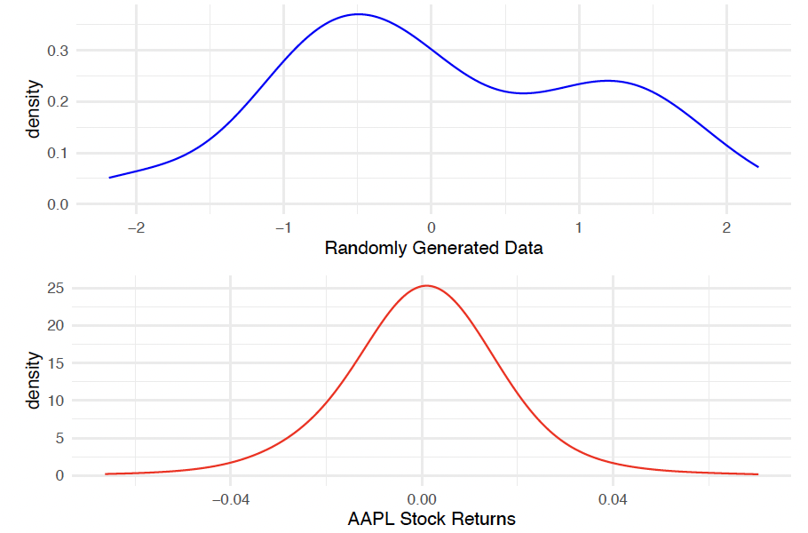
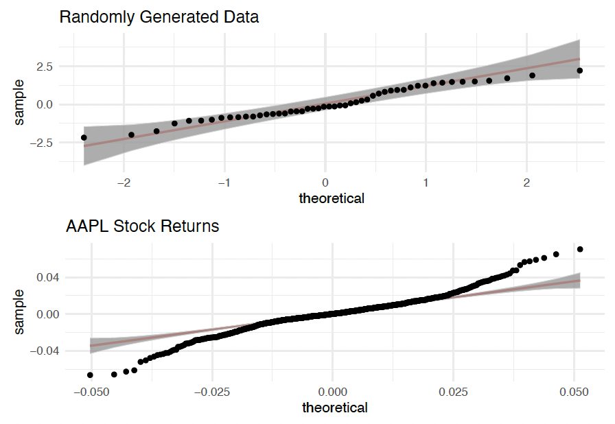
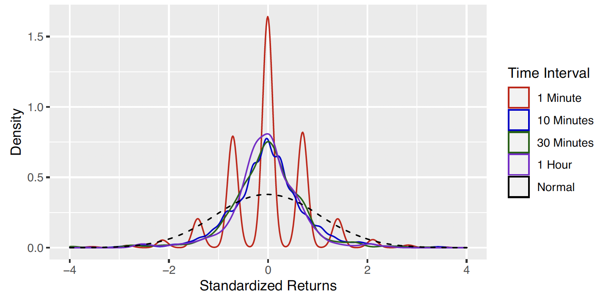

```{r, echo=FALSE, results='hide', message=FALSE}
library("tidyverse");theme_set(theme_minimal());library("patchwork");library("ggfunction")
```




## Inferential Statistics

:::{.absolute top=80px left=400px}
::: {style="width:200px;height:100px;background:transparent;border:4px solid; color:#bf5700;"}
:::
:::

:::{.absolute top=105px left=450px}
**Statistics**
:::

:::{.fragment}

:::{.absolute top=130px left=300px}
::: {style="width:100px;height:0px;background:transparent;border:2px solid;"}
:::
:::

:::{.absolute top=130px right=340px}
::: {style="width:100px;height:0px;background:transparent;border:2px solid;"}
:::
:::

:::{.absolute top=205px right=265px}
::: {style="width:150px;height:0px;background:transparent;border:2px solid;transform:rotate(90deg);"}
:::
:::

:::{.absolute top=205px left=225px}
::: {style="width:150px;height:0px;background:transparent;border:2px solid;transform:rotate(90deg);"}
:::
:::

:::{.absolute top=280px left=200px}
::: {style="width:200px;height:100px;background:transparent;border:4px solid; color:#bf5700;"}
:::
:::

:::{.absolute top=280px right=240px}
::: {style="width:200px;height:100px;background:transparent;border:4px solid; color:#bf5700;"}
:::
:::

:::{.absolute top=305px left=235px}
**Descriptive**
:::

:::{.absolute top=305px right=275px}
**Inferential**
:::
:::

:::{.fragment}

:::{.absolute top=432px left=255px}
::: {style="width:90px;height:0px;background:transparent;border:2px solid;transform:rotate(90deg);"}
:::
:::

:::{.absolute top=480px left=200px}
::: {style="width:200px;height:100px;background:transparent;border:4px solid; color:#bf5700;"}
:::
:::

:::{.absolute top=475px left=195px}
:::{style="font-size:.60em;"}
- **Collecting (Mining) Data**
- **Processing Data**
- **Visualizing Data**
- **Summarizing Data**
:::
:::

:::

:::{.fragment}

:::{.absolute top=475px right=245px}
:::{style="font-size:.65em;"}
- **Making inferences and** <br>
**drawing conclusions** <br> **from data**
:::
:::

:::{.absolute top=432px right=295px}
::: {style="width:90px;height:0px;background:transparent;border:2px solid;transform:rotate(90deg);"}
:::
:::

:::{.absolute top=480px right=240px}
::: {style="width:200px;height:100px;background:transparent;border:4px solid; color:#bf5700;"}
:::
:::
:::

:::{.incremental .absolute top=85%}
- **Inferential Statistics:** *the process of making judgments about a population based on properties of a sample randomly drawn from the population*
:::

# Basics of Intervals

## Parameter Statistic Refresher

:::{.callout-important title="Goal of Statistics" style="font-size:1.25em;"}
Generally, the goal of statistics is to determine some characteristic about the population of interest. 
:::

:::{.incremental}
- Generally, the characteristic of the population that we are interested in is a *parameter* [parameter is only know when we take a census]{.subtext}
:::

:::{.callout-note title="Reminder" .fragment style="font-size:1.25em;"}
We use a *statistic* to estimate a *parameter*
:::

## Parameter Statistic Refresher Cont.

:::{.callout-tip title="Example" style="font-size:1.2em;"}
Suppose the FDA requires more than 50% of possible patients to see improvement for a proposed drug to be approved. A pharmaceutical company in Austin, Tx has developed a new Alzheimer’s drug that is supposed to improve mental cognition, and they want to get the drug approved by the FDA.

:::{.fragment}
What is the population of interest?
:::

:::{.fragment}
[All possible Alzheimer patients]{.mysolution}
:::

:::{.fragment}
What is the parameter of interest?
:::

:::{.fragment}
[$p =$ the proportion of all Alzheimer patients that see improvement from the proposed drug]{.mysolution}
:::

:::{.fragment}
How would we estimate the parameter of interest?
:::

:::{.fragment}
[Conduct a clinical trial [and calculate $\hat{p} =$ sample proportion of Alzheimer patients from the clinical trial that saw improvement]{.fragment}]{.mysolution}
:::

:::{.fragment}
Suppose [$\hat{p} = 50.5\%$]{.mysolution}, should the drug be approved by the FDA?
:::

:::{.fragment}
[We don't know! $\hat{p} = 50.5\%$ is from one sample and does not guarantee that $p > 50\%$]{.mysolution}
:::

:::

## Estimators

:::{.incremental}
- **Estimator:** a statistic that estimates a parameter
  - Ex: $\bar{X}$ is an estimator for $\mu$
:::

:::{.incremental}
- **Point Estimate:** the numerical value of an estimator once a sample has been taken
  - Ex: Suppose a sample is taken and yields the observations 1, 2, and 3. [Then, $\bar{x} = \frac{1 + 2 + 3}{3} = 2$ is the *point estimate*.]{.fragment}

:::

:::{.callout-important title="Issue" .fragment style="font-size:1.25em;"}
We simply can not use a point estimate from one sample and generalize it to the entire population.
:::

<!-- :::{.callout-tip style="font-size:1.25em;" .fragment} -->
<!-- We need to account for the variability in taking a sample. -->
<!-- ::: -->

## An Aside: Properties of Estimators


## A Better Way of Estimating Parameters


:::{.callout-tip style="font-size:1.25em;" .fragment title="Example"}
Suppose you are interested in renting an apartment in West Campus and someone tells you they pay \$1,500 for a one-bedroom apartment. [Is \$1,500 a good estimate for what ALL one-bedroom apartments in West Campus cost?]{.fragment}

:::{.fragment}
[No! The apartment prices are going to vary.]{.mysolution} 
:::

:::{.fragment}
What would be a more informative way to estimate the typical price of a one bedroom apartment in West Campus?
:::

:::{.fragment}
[A range or interval! For example, (\$1200, \$2000).]{.mysolution}
:::

:::

:::{.callout-important style="font-size:1.25em;" .fragment title="Idea"}
We need to account for the variability in taking a sample when estimating a parameter
:::

## A Better Way of Estimating Parameters Cont.
:::{.callout-tip title="Example"}
Suppose the FDA requires more than 50% of possible patients to see improvement for a proposed drug to be approved. A pharmaceutical company in Austin, Tx has developed a new Alzheimer’s drug that is supposed to improve mental cognition, and they want to get the drug approved by the FDA. The company just finished its clinical trial and found 50.5% of those in the sample had improved mental cognition.

[Suppose, based upon the clinical trial results, a statistical interval for the proportion of Alzheimer patients who would see improvement is found to be (47.2%, 53.8%).]{.fragment style="font-size:1.3em;"} [Should the drug be approved?]{.fragment .underline style="font-size:1.3em;"}
:::

:::{.fragment}
[No! Even though for the clinical trial $\hat{p} = 50.5\%$, the interval for the true population proportion was found to be (47.2%, 53.8%), which includes 50% and values less than it.]{.mysolution}
:::


## Basics of Intervals

:::{.callout-tip title="Idea of Intervals" style="font-size:1.2em;"}
Rather than estimating a parameter with one number, it is more informative to estimate it with an interval of reasonable values.
:::

:::{.incremental}
- [**Formula for Intervals:** The basic formula to construct a statistical interval for a parameter is given by]{style="font-size:.95em;"} 

:::{.fragment .center}
[Point Estimate $\pm$ Error]{.mysolution}
:::

:::{.fragment}
$\quad$ which yields
:::

:::{.fragment .center}
[(Lower Bound, Upper Bound)]{.mysolution}
:::

:::{.fragment .center}
or
:::

:::{.fragment .center}
[Lower Bound $<$ parameter $<$ Upper Bound]{.mysolution}
:::

:::{.fragment .subtext}
For short hand, we will use LB and UB for lower and upper bound, respectively
:::
:::

## Basics of Intervals: Error and Length

- **Margin of Error (E):** *represents the uncertainty in using an interval to estimate the true value of the parameter*

:::{.incremental}
- **Length of Interval (L):** refers to how "wide" the interval is, i.e the distance between the *UB* and *LB*

:::{.fragment .center}
[$L = UB - LB$]{.mysolution}
:::

- The *Margin of Error* and *Length* have the following relationships

:::{.fragment .center}
[$L = 2E \iff E = L/2$]{.mysolution}
:::

- **Point Estimate:** given an interval $(LB, UB)$, we can determine the *point estimate* value using the following

:::{.center}
[[$Pt. Est = \frac{LB + UB}{2}\ $ or $\ UB - E\ $ or $\ LB + E$]{.mysolution}]{.fragment}
:::

:::

## Basics of Intervals Cont.

:::{.callout-tip style="font-size:1.25em;" .fragment title="Example"}
Suppose a statistical interval for $\sigma^{2}$ is found to be (3, 7). Find the following. 
:::

:::{.incremental}
1. The length of the interval

:::{.fragment}

:::{.mysolution}
$L = UB - LB = 7 - 3 = 4$
:::

:::

2. The margin of error for the interval

:::{.fragment}

:::{.mysolution}
$E = L/2 = 4/2 = 3.5$
:::

:::

3. The point estimate $s^{2}$

:::{.fragment}

:::{.mysolution}
$Pt. Est = s^2 = \frac{LB + UB}{2} = \frac{3 + 7}{2} = 5$
:::

:::

:::

# Confidence Intervals

## Confidence Intro. 

:::{.callout-tip title="Example" style="font-size:1.25em;"}
Suppose you are interested in renting an apartment in West Campus and someone tells you they are "confident" that the average rent for a one-bedroom is between (\$0, \$1 Billion). 
:::

:::{.fragment}
Are they correct? 
:::

:::{.fragment}
[Yes!]{.mysolution}
:::

:::{.fragment}
Is their interval helpful?
:::

:::{.fragment}
[No! They are "confident" that they are correct because their interval is so wide.]{.mysolution}
:::

:::{.incremental}
- We have been referring to "statistical" intervals, but now we want to formally define the intervals
  - The goal is to construct an interval that balances "confidence" and informativeness
:::

## Confidence Intervals Intro.

:::{.callout-tip title="Idea" style="font-size:1.25em;"}
Instead of using a single point to estimate the parameter, we use a range of plausible values i.e an interval. [Along with that range, we report how "confident" we are that the interval captures the true value of the parameter.]{.fragment}
:::

:::{.incremental}
- A useful interval should therefore be:
  - "confident" enough to reliably capture the parameter
  - narrow enough to still be informative
:::

:::{.incremental}
- **Confidence Interval:** *an interval estimate of a parameter in which we include how "confident" we are that the interval contains the true value of the parameter we are estimating*
:::


<!-- :::{.callout-note title="Reminder" style="font-size:1.2em;" .fragment} -->
<!-- The true value of a parameter is unknown.  -->
<!-- ::: -->


<!-- - Confidence -->

## What Confidence Means
<!-- A confidence interval is an interval estimate of the parameter in which we include how “confident” we are that the interval contains the parameter we are estimating. -->

:::{.callout-tip title="Example" style="font-size:1.2em;"}
Suppose we are constructing 90% "confidence" intervals for the population mean $\mu$. Further suppose that the true value of $\mu = 50$. 
:::

```{ojs}
//| echo: false
//| panel: sidebar
viewof ciLevel = Inputs.select(["90%", "95%", "99%"], { value: "95%", label: "Confidence Level" })
viewof ciDrawOne = Inputs.button("Draw Sample and Construct Interval")
viewof ciDrawMany = Inputs.button("Draw 100 Samples")
```

```{ojs}
//| echo: false
//| panel: fill

ciPopMean = 50
ciPopSD = 10
ciSampleSize = 30
ciZValues = ({ "90%": 1.645, "95%": 1.96, "99%": 2.576 })
ciSE = ciPopSD / Math.sqrt(ciSampleSize)
ciMargin = 8 * ciSE
ciDomain = [ciPopMean - ciMargin, ciPopMean + ciMargin]

ciPopSize = 500
ciPopRadius = 90

ciPopulation = d3.range(ciPopSize).map(i => {
  const r = ciPopRadius * Math.sqrt(Math.random());
  const theta = Math.random() * 2 * Math.PI;
  return {
    id: i,
    value: d3.randomNormal(ciPopMean, ciPopSD)(),
    x: r * Math.cos(theta),
    y: r * Math.sin(theta)
  };
})

function ciDrawInterval() {
  const z = ciZValues[ciLevel];
  const idx = d3.shuffle(d3.range(ciPopulation.length)).slice(0, ciSampleSize);
  const sampleValues = idx.map(i => ciPopulation[i].value);
  const xbar = d3.mean(sampleValues);
  const lower = xbar - z * ciSE;
  const upper = xbar + z * ciSE;
  const captures = lower <= ciPopMean && ciPopMean <= upper;
  return { xbar, lower, upper, captures, sampledIds: new Set(idx) };
}

ciState = Generators.observe(notify => {
  ciLevel;

  let history = [];
  let latestSampledIds = new Set();
  notify({ history, latestSampledIds });

  const handleDrawOne = () => {
    const result = ciDrawInterval();
    history = [...history, result];
    latestSampledIds = result.sampledIds;
    notify({ history, latestSampledIds });
  };

  const handleDrawMany = () => {
    const newIntervals = d3.range(100).map(() => ciDrawInterval());
    history = [...history, ...newIntervals];
    latestSampledIds = newIntervals[newIntervals.length - 1].sampledIds;
    notify({ history, latestSampledIds });
  };

  viewof ciDrawOne.addEventListener("click", handleDrawOne);
  viewof ciDrawMany.addEventListener("click", handleDrawMany);

  return () => {
    viewof ciDrawOne.removeEventListener("click", handleDrawOne);
    viewof ciDrawMany.removeEventListener("click", handleDrawMany);
  };
})

ciData = ciState.history.map((d, i) => ({ ...d, index: ciState.history.length - i }))

ciCaptureRate = ciState.history.length > 0
  ? (100 * d3.mean(ciState.history, d => d.captures ? 1 : 0)).toFixed(1)
  : null

ciPopulationViz = {
  const size = ciPopRadius * 2 + 20;
  const c = size / 2;
  const dots = ciPopulation.map(d => {
    const hi = ciState.latestSampledIds.has(d.id);
    return `<circle cx="${(c + d.x).toFixed(1)}" cy="${(c + d.y).toFixed(1)}" r="3" fill="${hi ? "#BF5700" : "#9CA3AF"}" opacity="${hi ? 1 : 0.5}"></circle>`;
  }).join("");
  const div = document.createElement("div");
  div.innerHTML = `<svg width="${size}" height="${size}" viewBox="0 0 ${size} ${size}">
    <circle cx="${c}" cy="${c}" r="${ciPopRadius}" fill="none" stroke="#333" stroke-width="1.5"></circle>
    ${dots}
  </svg>`;
  return div;
}

ciPlot = Plot.plot({
  width: 480,
  height: Math.max(300, ciData.length * 10),
  marginLeft: 20,
  marginTop: 10,
  style: { fontSize: "12px" },
  marks: [
    Plot.ruleX([ciPopMean], { stroke: "black", strokeDasharray: "4,2" }),
    Plot.ruleY(ciData, {
      y: "index", x1: "lower", x2: "upper",
      stroke: d => d.captures ? "#4C72B0" : "#D62728",
      strokeWidth: 2
    }),
    Plot.dot(ciData, { x: "xbar", y: "index", r: 2, fill: "black" })
  ],
  x: { label: "value", domain: ciDomain },
  y: { axis: null, reverse: true }
})

{
  const container = document.createElement("div");
  container.style.display = "flex";
  container.style.alignItems = "flex-start";
  container.style.gap = "2em";
  container.style.flexWrap = "nowrap";

  const popWrap = document.createElement("div");
  popWrap.style.textAlign = "center";
  popWrap.style.flexShrink = "0";
  const popLabel = document.createElement("div");
  popLabel.style.fontWeight = "600";
  popLabel.style.marginBottom = "0.5em";
  popLabel.textContent = "Population";
  popWrap.append(popLabel, ciPopulationViz);

  const rightWrap = document.createElement("div");
  rightWrap.style.display = "flex";
  rightWrap.style.flexDirection = "column";
  rightWrap.style.alignItems = "center";
  rightWrap.style.gap = "0.5em";

  const summary = document.createElement("div");
  summary.style.fontSize = "1.1em";
  summary.innerHTML = ciData.length > 0
    ? `${ciData.length} interval${ciData.length === 1 ? "" : "s"} drawn — <strong>${ciCaptureRate}%</strong> have captured μ = ${ciPopMean}`
    : `Click "Draw Sample" to construct a ${ciLevel} confidence interval for μ = ${ciPopMean}`;

  const plotWrap = document.createElement("div");
  plotWrap.style.maxHeight = "420px";
  plotWrap.style.overflowY = "auto";
  plotWrap.appendChild(ciPlot);

  rightWrap.append(summary, plotWrap);

  container.append(popWrap, rightWrap);
  return container;
}
```

## Confidence Cont.

:::{.incremental}
- **Confidence:** *will refer to % of times the method used to construct the interval captures the true value of the parameter if we took repeated samples*
  - Generally, researchers construct 90%, 95%, or 99% confidence intervals [the confidence % is also referred to as the confidence level]{.subtext}
:::

:::{.callout-tip title="Example" style="font-size:1.25em;" .fragment}
Suppose you are interested in renting an apartment in West Campus and someone tells you they are "confident" that the average rent for a one-bedroom is between (\$0, \$1 Billion). [What confidence level do we think this interval is?]{.underline .fragment}
:::

:::{.fragment .mysolution}
[100% because the interval is so wide, it will always be correct.]{.mysolution}
:::

:::{.incremental}
- Thus, confidence level and interval length have the following relationship:
:::

:::{.fragment .center}
[As the confidence % increases, the interval length increases [and vice-versa]{.subtext}]{.mysolution}
:::

## Constructing Confidence Intervals

:::{.callout-note title="Reminder" style="font-size:1.2em;"}
1. The basic formula to construct a statistical interval for a parameter is given by: *Point Estimate* $\pm$ *Error*

:::{.fragment}
2. Margin of Error represents the uncertainty in using an interval estimate 
:::
:::

:::{.incremental}
- In general, what statistical tool do we use to quantify uncertainty? [[probability!]{.mysolution}]{.fragment}
- What describes all possible values of a statistic that can be obtained? [[sampling distribution [i.e probability distribution for a statistic]{.subtext}]{.mysolution}]{.fragment}
:::

:::{.fragment .center}
```{r, echo=FALSE, fig.height=3}
# Normal curve
x <- seq(-3.5, 3.5, length.out = 500)
df <- data.frame(
  x = x,
  y = dnorm(x)
)

# Bounds
LB <- -1.2
UB <-  1.2

ggplot(df, aes(x, y)) +
  geom_line(linewidth = 1) +
  
  # Lower and upper bounds
  geom_segment(
    aes(x = LB, xend = LB, y = 0, yend = dnorm(LB)),
    linewidth = 0.8
  ) +
  geom_segment(
    aes(x = UB, xend = UB, y = 0, yend = dnorm(UB)),
    linewidth = 0.8
  ) +
  
  # Confidence arrow
  annotate(
    "segment",
    x = LB + 0.12, xend = UB - 0.12,
    y = 0.13, yend = 0.13,
    arrow = arrow(ends = "both", length = unit(0.12, "in"))
  ) +
  
  annotate(
    "text",
    x = 0, y = 0.175,
    label = "Level of\nConfidence",
    size = 5
  ) +
  
  # LB and UB labels
  annotate(
    "text",
    x = LB, y = -0.018,
    label = "LB",
    size = 5
  ) +
  annotate(
    "text",
    x = UB, y = -0.018,
    label = "UB",
    size = 5
  ) +
  
  coord_cartesian(
    xlim = c(-3.3, 3.3),
    ylim = c(-0.035, 0.42),
    clip = "off"
  ) +
  theme(
    axis.title = element_blank(),
    axis.text = element_blank(),
    axis.ticks = element_blank()
  )
```

:::

## CI for $\mu$ with $\sigma$ known

:::{.callout-note title="Central Limit Theorem (CLT)" style="font-size:1em;"}
Suppose $X$ is distributed with mean $\mu$ and standard deviation $\sigma$. Then, for a "sufficiently large" sample size $n$, the sampling distribution of $\bar{X}$ is $\bar{X} \stackrel{\cdot}{\sim} \mathcal{N}(\mu, \sigma/\sqrt{n}).$
:::

:::{.fragment .center}
```{r, echo=FALSE, fig.height=3.5}
# Normal curve
x <- seq(-3.5, 3.5, length.out = 500)
df <- data.frame(
  x = x,
  y = dnorm(x)
)

# Bounds
LB <- -1.2
UB <-  1.2

ggplot(df, aes(x, y)) +
  geom_line(linewidth = 1) +
  
  # Lower and upper bounds
  geom_segment(
    aes(x = LB, xend = LB, y = 0, yend = dnorm(LB)),
    linewidth = 0.8
  ) +
  geom_segment(
    aes(x = UB, xend = UB, y = 0, yend = dnorm(UB)),
    linewidth = 0.8
  ) +
  
  # Confidence arrow
  annotate(
    "segment",
    x = LB + 0.12, xend = UB - 0.12,
    y = 0.13, yend = 0.13,
    arrow = arrow(ends = "both", length = unit(0.12, "in"))
  ) +
  
  annotate(
    "text",
    x = 0, y = 0.175,
    label = "Level of\nConfidence",
    size = 5
  ) +
  
  # LB and UB labels
  annotate(
    "text",
    x = LB, y = -0.018,
    label = "LB",
    size = 5
  ) +
  annotate(
    "text",
    x = UB, y = -0.018,
    label = "UB",
    size = 5
  ) +
  
  coord_cartesian(
    xlim = c(-3.3, 3.3),
    ylim = c(-0.035, 0.42),
    clip = "off"
  ) +
  theme(
    axis.title = element_blank(),
    axis.text = element_blank(),
    axis.ticks = element_blank()
  )
```

:::

:::{.callout-note title="Confidence Interval for $\mu$ with known $\sigma$" style="font-size:1.2em;" .fragment}
Suppose $\sigma$ is known. Then, a (1 - $\alpha$)% confidence interval for $\mu$ is given by [[$\bar{x} \pm Z_{\alpha/2} \cdot \sigma/\sqrt{n}$]{.mysolution}]{.fragment}
:::

## CI for $\mu$ with $\sigma$ known Cont.
:::{.callout-tip title="Example" style="font-size:1.2em;"}
A hospital wants to estimate the average systolic blood pressure of its adult patients. Suppose it is known that the population standard deviation is 16 mmHg. The hospital took 
a random sample of 64 patients and found that the mean systolic blood pressure of was $128$ mmHg for the sample. [The hospital wants to construct a 95% confidence interval for the mean systolic blood pressure for the population.]{.fragment .underline} 
:::

# T-Confidence Interval
## Issue with CI for $\mu$ with $\sigma$ known

:::{.callout-note title="Reminder: CI for $\mu$ with known $\sigma$" style="font-size:1.2em;" .fragment}
Suppose $\sigma$ is known. Then, a (1 - $\alpha$)% confidence interval for $\mu$ is given by $\bar{x} \pm Z_{\alpha/2} \cdot \sigma/\sqrt{n}$
:::

:::{.incremental}
- The goal of a confidence interval for $\mu$ is to [[estimate $\mu$]{.underline .mysolution}]{.fragment}
  - Do we know the value of $\mu$? [No! [That is why we are estimating it]{.subtext}]{.mysolution}
:::

:::{.callout-important title="Issue" style="font-size:1.2em;" .fragment }
Is it likely that we know $\sigma$? [[No! [We don't know $\mu$, so how would we know $\sigma$?]{.subtext}]{.mysolution}]{.fragment}
:::

:::{.incremental}
- What can we use to estimate $\sigma$? [[$s$, the sample standard deviation]{.mysolution}]{.fragment}
:::


## CI for $\mu$ with unknown $\sigma$


:::{.incremental}
- We used the CLT, $\bar{X} \stackrel{\cdot}{\sim} N(\mu, \sigma/\sqrt{n})$ to get the confidence interval for $\mu$
  - However, now, we have to estimate $\sigma$ with $s$
  - Thus, the sampling distribution used to construct the confidence interval for $\mu$ will no longer be normally distributed
:::

:::{.callout-note title="t Confidence Interval" style="font-size:1.2em;" .fragment}
Suppose $\sigma$ is unknown. Then, a (1 - $\alpha$)% confidence interval for $\mu$ is given by 

:::{.center .fragment}
:::{.mysolution style="font-size:1.2em;"}
$\bar{x} \pm t_{\alpha/2} \cdot s/\sqrt{n}$, 
:::
:::

:::{.fragment}
where $t_{\alpha}$ is the $\alpha$ percentile of the $t($ [$df = n - 1$]{.mysolution} $)$ distribution. [*df* stands for degrees of freedom and parameterizes the t-distribution]{.subtext}
:::

:::{.fragment}
**Assumption for the Confidence Interval:** [The random variable $X$ (our data) is normally distributed [often referred to as the "normality assumption"]{.subtext}]{.mysolution} 
:::

:::

## t-Distribution

:::{.incremental}
- The t-distribution is parameterized by the "degrees of freedom" (df)
  - it is very similar to the standard normal distribution but it has "fatter" tails [i.e. more values are in the extreme]{.subtext}  


```{ojs}
//| echo: false
//| panel: sidebar
viewof tdDf = Inputs.range([1, 15], { value: 1, step: 1, label: "Degrees of freedom (df)" })
```

```{ojs}
//| echo: false
//| panel: fill

function tdLogGamma(x) {
  const g = 7;
  const c = [
    0.99999999999980993, 676.5203681218851, -1259.1392167224028,
    771.32342877765313, -176.61502916214059, 12.507343278686905,
    -0.13857109526572012, 9.9843695780195716e-6, 1.5056327351493116e-7
  ];
  if (x < 0.5) {
    return Math.log(Math.PI / Math.sin(Math.PI * x)) - tdLogGamma(1 - x);
  }
  x -= 1;
  let a = c[0];
  const t = x + g + 0.5;
  for (let i = 1; i < g + 2; i++) a += c[i] / (x + i);
  return 0.5 * Math.log(2 * Math.PI) + (x + 0.5) * Math.log(t) - t + Math.log(a);
}

function dt(x, df) {
  const logCoef = tdLogGamma((df + 1) / 2) - tdLogGamma(df / 2) - 0.5 * Math.log(df * Math.PI);
  const logKernel = -((df + 1) / 2) * Math.log(1 + (x * x) / df);
  return Math.exp(logCoef + logKernel);
}

tdXMin = -6
tdXMax = 6
tdXValues = d3.range(tdXMin, tdXMax, 0.05)
tdData = tdXValues.map(x => ({ x, density: dt(x, tdDf) }))

Plot.plot({
  width: 520,
  height: 240,
  marginLeft: 55,
  marginTop: 25,
  style: { fontSize: "13px" },
  marks: [
    Plot.line(tdData, { x: "x", y: "density", stroke: "#BF5700", strokeWidth: 2 }),
    Plot.ruleY([0])
  ],
  x: { label: "t", domain: [tdXMin, tdXMax] },
  y: { label: "f(t)", domain: [0, 0.42], labelAnchor: "center", labelArrow: "none" },
  subtitle: `t-distribution (df = ${tdDf})`
})
```


- There are percentile tables for the t-distribution: [t-Table link](https://deriktboonstra.github.io/UT-SDS320E/T_table.pdf)
:::


## Accessing Distributional Assumption

:::{.incremental style="font-size:.8em;"}
- The assumption for the *t* confidence interval was that our data comes from a normal distribution
  - One way to visually check whether our data follows a certain distribution is to use a QQ-plot
:::

:::{.absolute top=20%}
:::{.callout-tip title="QQ-Plot" style="font-size:1.1em;" .fragment}
A QQ-plot plots the percentiles/quantiles of our data against the *theoretical quantiles* if our data came from the assumed distribution

:::{.fragment}
If our data actually comes from the assumed distribution, what would be the relationship between the *theoretical quantiles* and the *actual quantiles*? [[We would expect the theoretical quantiles $\approx$ actual quantiles]{.mysolution}]{.fragment}
:::

:::{.fragment}
If our data actually comes from the assumed distribution, what would we expect to see when we plot the *theoretical quantiles* against the *actual quantiles*?
:::

<br><br><br><br><br><br><br><br><br><br>


:::
:::

:::{.fragment .absolute top=60% left=10%}
```{r, echo=FALSE, fig.height=3, fig.width=8}
set.seed(1)
x <- rnorm(100)
y <- x + rnorm(100, sd = 0.01)
ggplot(aes(x, y), data = NULL)+
  # geom_point()+
  # geom_line(color = "red")+
  labs(y = "Actual Quantile", x = "Theoretical Quantiles")
```

:::

:::{.fragment .absolute top=60% left=10%}

:::{.mysolution}
```{r, echo=FALSE, fig.height=3, fig.width=8}
set.seed(1)
x <- rnorm(100)
y <- x + rnorm(100, sd = 0.01)
ggplot(aes(x, y), data = NULL)+
  geom_point()+
  # geom_line(color = "red")+
  labs(y = "Actual Quantile", x = "Theoretical Quantiles")
```
:::
:::


:::{.fragment}

:::{.absolute top=54% left=45%}
[A line!]{.mysolution style="font-size:.8em;"}
:::

:::{.absolute top=60% left=10%}
:::{.mysolution}
```{r, echo=FALSE, fig.height=3, fig.width=8}
set.seed(1)
x <- rnorm(100)
y <- x + rnorm(100, sd = 0.01)
ggplot(aes(x, y), data = NULL)+
  geom_point()+
  geom_line(color = "red")+
  labs(y = "Actual Quantile", x = "Theoretical Quantiles")
```
:::
:::

:::

## Using a QQ Plot

:::{.callout-tip title="QQ-Plot interpretation" style="font-size:1.2em;"}
If most of the points for the QQ-plot fall close to the line, then we say it is reasonable to assume our data came from the proposed distribution.
:::

- To construct a QQ-plot in R, we can use the `qqnorm()` function or `qqplotr` package [the default QQ-plot is for the normal distribution, but QQ-plots can be for other distributions: uniform, exponential, beta, ect.]{.subtext style="font-size:.6em;"}

:::{.fragment}
::: panel-tabset

### Base R

:::{style="font-size:.6em;"}
```{r, eval=FALSE}
qqnorm(iris$Sepal.Width)
qqline(iris$Sepal.Width, col = "red")
```
:::

:::{.center}
```{r, fig.height=2.5, fig.width=8, echo=FALSE}
qqnorm(iris$Sepal.Width)
qqline(iris$Sepal.Width, col = "red")
```
:::

### ggplot

:::{style="font-size:.7em;"}
```{r, fig.height=3, fig.width=8, eval=FALSE}
library("qqplotr")
ggplot(aes(sample = Sepal.Width), data = iris)+
  stat_qq_line(color = "red") +
  stat_qq_point()
```
:::

:::{.center}
```{r, fig.height=2, fig.width=8, echo=FALSE}
library("qqplotr")
ggplot(aes(sample = Sepal.Width), data = iris)+
  stat_qq_line(color = "red") +
  stat_qq_point()
```
:::

:::

:::

## Using a QQ Plot Cont. 

- To access if points are close to the line, confidence bands are often used with QQ-plots
  - For Base plot, use must use the `car` package

::: panel-tabset

### Base R

:::{style="font-size:.8em;"}
```{r, fig.height=3.5, fig.width=8, eval=FALSE}
car::qqPlot(iris$Sepal.Width)
```
:::

:::{.center}
```{r, fig.height=3.5, fig.width=8, echo=FALSE}
out <- car::qqPlot(iris$Sepal.Width)
```
:::

### ggplot

:::{style="font-size:.7em;"}
```{r, fig.height=3.5, fig.width=8, eval=FALSE}
library("qqplotr")
ggplot(aes(sample = Sepal.Width), data = iris)+
  stat_qq_band(color = "lightgrey")+
  stat_qq_line(color = "red") +
  stat_qq_point()
```
:::

:::{.center}
```{r, fig.height=3.2, fig.width=8, echo=FALSE}
library("qqplotr")
ggplot(aes(sample = Sepal.Width), data = iris)+
  stat_qq_band(color = "lightgrey")+
  stat_qq_line(color = "red") +
  stat_qq_point()
```
:::

:::

## QQ-Plot for Normal Distribution

- For a normal distribution QQ-plot, we expect it to be sensitive to skewness 

```{r, echo=FALSE}
set.seed(1)
p1 <- tibble("Symmetric" = rnorm(1000), 
       "Right Skewed" = rexp(1000, rate = 1), 
       "Left Skewed" = -rexp(1000, rate = 1)) |> 
  pivot_longer(everything(), names_to = "shape") |> 
  mutate("shape" = as_factor(shape)) |> 
  ggplot(aes(value, color = shape))+
  geom_density()+
  facet_wrap(~shape, scales ="free")+
  theme(strip.background = element_rect(fill = "lightgrey"), 
        axis.text.y = element_blank(), 
        axis.text.x = element_blank(), 
        axis.title.x = element_blank(), 
        legend.position = "none")+
  ggh4x::facetted_pos_scales(x = list(
    shape ==  "Symmetric" ~ scale_x_continuous(limits = c(-3, 3)),
    shape ==  "Right Skewed" ~ scale_x_continuous(limits = c(-.5, 6)),
    shape ==  "Left Skewed" ~ scale_x_continuous(limits = c(-6, .6))
  ))

set.seed(1)
p2 <- tibble("Symmetric" = rnorm(1000), 
       "Right Skewed" = rexp(1000, rate = 1), 
       "Left Skewed" = -rexp(1000, rate = 1)) |> 
  pivot_longer(everything(), names_to = "shape") |> 
  mutate("shape" = as_factor(shape)) |> 
  ggplot(aes(sample = value))+
  stat_qq_band(color = "lightgrey")+
  stat_qq_line(aes(color = shape)) +
  stat_qq_point()+
  facet_wrap(~shape, scales ="free")+
  theme(strip.background = element_blank(),
        strip.text = element_blank(),
        axis.text.y = element_blank(), 
        axis.text.x = element_blank(), 
        legend.position = "none")

p1/p2
```

## Why QQ-plots?
:::{.incremental style="font-size:.9em;"}
- A QQ-plot gives us a way the check distributions, but the idea under it may seem confusing. What are other ways to check distribution? 
  - [Histogram/Density]{.mysolution}
- Why not use those instead of a QQ-plot? 
:::

:::{.fragment}
:::{.callout-tip title="Example"}
Consider random generated data and also Stock Return data for Apple in 2018. Which data appears to follow the normal distribution?
:::

:::{.center}
{width=40%}
:::

:::

## Why QQ-Plots Cont.
- However, if we look at the QQ-plots for each, we find a different story. The Apple returns clearly are not normal. 

:::{.center}
{width=60%}
:::

## Why QQ-Plots Cont.

:::{.incremental}
- Why is this the case? 
  - Distribution plots focus on the center of the data and can often miss displaying the tails [remember over/under plotting?]{.subtext}
:::

:::{.fragment}
- Stock returns are famous for having excess information in the tails. This becomes worse as we consider intra-day returns. 

:::{.center}
{width=50%}
:::

:::

## CI for $\mu$ Example
  
:::{.callout-tip title="Example" style="font-size:1.1em;"}
A hospital wants to estimate the average bacterial count remaining on surgical instruments after a sterilization procedure. The hospital took a random sample of 25 sterilized instruments and found that the mean bacterial count was 6.8 CFU, with a sample standard deviation of 4.5 CFU. The hospital wants to construct a 90% confidence interval for the mean bacterial count for all instruments sterilized using this procedure. 
:::


  
```{r, echo=FALSE}
# Set seed so the data are reproducible
set.seed(123)

z <- rnorm(25)
bacteria <- 6.8 + 4.5 * (z - mean(z)) / sd(z)
sterilization_data <- data.frame(
  instrument = 1:25,
  CFU = bacteria
)
sterilization_data$CFU[18] <- 2.3892818
```

:::{.columns}

:::{.column width=25% .fragment}
```{r, echo=TRUE, eval=FALSE}
sterilization_data
```


:::{style="font-size:.6em;"}
```{r, echo=FALSE}
sterilization_data |> 
  head(10) |> 
  knitr::kable()
```
:::
:::

:::{.column width=5%}
:::


:::{.column width=70%}

:::{.fragment style="font-size:.7em;"}
Before, we calculate the interval, what must verify the assumption for the t-interval. What is the assumption for the t-confidence interval?
:::

:::{.fragment style="font-size:.7em;"}

:::{.mysolution}
Normality
:::
:::

:::{.fragment style="font-size:.7em;"}
How we do check the assumption?
:::

:::{.fragment style="font-size:.7em;"}

:::{.mysolution}
QQ-plot
:::
:::


:::
:::

## CI for $\mu$ Example Cont.

```{r, fig.height=3.5}
library("qqplotr")
ggplot(aes(sample = CFU), data = sterilization_data)+
  stat_qq_band(color = "lightgrey")+
  stat_qq_line(color = "red") +
  stat_qq_point()
```

:::{.fragment}
Does the assumption seem reasonable? [[Yes! Most of the points are within the bounds and close to the line]{.mysolution}]{.fragment}
:::


## CI for $\mu$ Example Cont.

:::{.callout-tip title="Example" style="font-size:1.1em;"}
A hospital wants to estimate the average bacterial count remaining on surgical instruments after a sterilization procedure. The hospital took a random sample of 25 sterilized instruments and found that the mean bacterial count was 6.8 CFU, with a sample standard deviation of 4.5 CFU. The hospital wants to construct a 90% confidence interval for the mean bacterial count for all instruments sterilized using this procedure. 
:::

:::{.fragment}
Now that we verified the assumptions for the interval, we can continue to construct the t-confidence interval.
:::

## t Confidence Interval in R

:::{.incremental style="font-size:0.9em;"}
- To get a t confidence interval for $\mu$ in R, we can use the `t.test()` function. It has the following arguments:
  - `x`: the numeric vector of data
  - `conf.level`: the confidence level of the interval (default is 0.95)
  - `alternative`, `mu`: used for hypothesis tests, so we can leave these at their defaults for now
- `t.test()` returns a lot of output, so we use `$conf.int` to extract only the interval
:::

:::{.fragment}
```{r}
# 90% CI for the mean bacterial count (CFU)
t.test(sterilization_data$CFU, conf.level = 0.90)$conf.int
```
:::

# The End {visibility="uncounted"}


